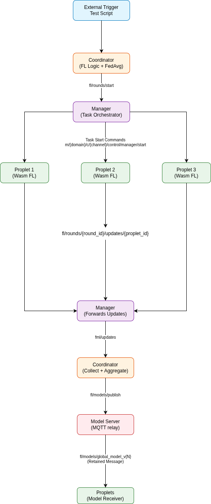

# Federated Machine Learning in Propeller

Propeller implements Federated Machine Learning (FML) as a workload-agnostic federated learning framework that enables distributed machine learning training across multiple edge devices without centralizing raw data. This document explains the motivation for federated learning, the high-level architecture of Propeller's FML system, and how the components interact during a training round.

## Motivation for Federated Learning

Federated learning addresses several critical challenges in distributed machine learning:

### Data Locality and Privacy

Traditional centralized machine learning requires moving raw data from edge devices to a central server for training. This approach has significant drawbacks:

- **Privacy Concerns**: Sensitive data (medical records, personal information, proprietary sensor data) must leave the device, creating privacy risks and regulatory compliance challenges.
- **Data Sovereignty**: Organizations may be legally or contractually prohibited from moving data off-premises or across geographic boundaries.
- **Bandwidth Constraints**: Transferring large datasets from edge devices to the cloud consumes significant network bandwidth and may be impractical in bandwidth-constrained environments.

Federated learning solves these problems by keeping raw data on the device. Only model updates (weight gradients or deltas) are transmitted, not the underlying training data. This preserves privacy while enabling collaborative model improvement.

### Distributed Assets and Edge Computing

Modern IoT and edge computing deployments involve thousands or millions of devices distributed across diverse locations:

- **Geographic Distribution**: Devices may be spread across multiple sites, cities, or countries, making centralized data collection impractical.
- **Resource Constraints**: Edge devices often have limited storage, compute, and network capabilities, making them unsuitable for large-scale centralized training.
- **Real-time Requirements**: Many applications require models that adapt to local conditions in real-time, which is difficult to achieve with centralized training.

Federated learning leverages the distributed nature of edge deployments by training models locally on each device, then aggregating the learned knowledge without moving raw data.

### Scalability and Efficiency

Federated learning provides natural scalability advantages:

- **Parallel Training**: Multiple devices train simultaneously, reducing overall training time compared to sequential centralized training.
- **Reduced Server Load**: The central coordinator only aggregates updates, not raw data, significantly reducing computational and storage requirements.
- **Incremental Learning**: New devices can join the federation without retraining from scratch, and models can be updated incrementally as new data becomes available.

## Architecture

Propeller's FML system is built on a workload-agnostic design where the core orchestration layer (Manager) provides HTTP endpoints for FL operations but delegates all FL-specific logic to an external Coordinator service. This separation of concerns allows Propeller to support federated learning while remaining flexible enough to orchestrate other types of distributed workloads.

### Core Design Principles

1. **Workload-Agnostic Manager**: The Manager service provides HTTP endpoints for FL operations and orchestrates task distribution without understanding FL semantics. It forwards requests to the Coordinator and publishes round start messages via MQTT.

2. **External Coordinator**: FL-specific logic (round management, aggregation algorithms, model versioning, update collection) is implemented in a separate Coordinator service that can be developed, deployed, and scaled independently.

3. **Hybrid Communication Pattern**: Components communicate via a mix of HTTP and MQTT. HTTP is used for synchronous operations (task requests, update submission) while MQTT handles orchestration (round start, completion notifications).

4. **WASM-Based Training**: Training workloads execute as WebAssembly modules.

## System Components

Propeller's FML system consists of the following components that work together to enable federated learning:

### Manager Service

The Manager is Propeller's core orchestration component. In the context of federated learning, it provides HTTP endpoints for FL operations and orchestrates task distribution via MQTT.

**Responsibilities**:

- **Experiment Configuration**: The Manager exposes `POST /fl/experiments` to configure FL experiments.

- **Task Creation and Distribution**: When a federated learning round starts, the Manager receives the round start message and creates training tasks for each participating proplet (edge device).

- **HTTP Endpoint Proxies**: The Manager provides HTTP endpoints that proxy requests to Coordinator.
  - `GET /fl/task?round_id={id}&proplet_id={id}` - Forward task requests to Coordinator
  - `POST /fl/update` - Forward update submissions to Coordinator (JSON)
  - `POST /fl/update_cbor` - Forward update submissions to Coordinator (CBOR)
  - `GET /fl/rounds/{round_id}/complete` - Check round completion status

**Note**: Proplets communicate directly with the Coordinator's endpoints (not through Manager proxies).

- **Proplet Management**: The Manager maintains awareness of available proplets and their health status.

**Key Design**: Propeller's Manager delegates all FL-specific logic to the external Coordinator.

### FML Coordinator

The Coordinator is the FL-specific service that manages the federated learning lifecycle, from round initialization through aggregation to model publication.

**Responsibilities**:

- **Experiment Configuration**: The Coordinator receives experiment configuration via HTTP `POST /experiments` from the Manager.

- **Task Provisioning**: The Coordinator provides FL task details to proplets via HTTP `GET /task`.

- **Update Collection**: The Coordinator receives training updates from proplets via HTTP `POST /update` (JSON) or `POST /update_cbor` (CBOR).

- **Aggregation Orchestration**: When the minimum number of updates (k-of-n) is received, the Coordinator calls the Aggregator service.

- **Model Versioning**: The Coordinator maintains a version counter for global models, incrementing it each time a new aggregated model is created.

- **Model Storage**: The Coordinator stores aggregated models in the Model Registry via HTTP POST.

- **Round Completion**: The Coordinator handles round completion, either when sufficient updates are received or when a timeout is reached.

- **Timeout Handling**: The Coordinator monitors each round for timeouts. If a round doesn't receive sufficient updates within the specified timeout period, it aggregates whatever updates have been received (if any) and completes the round.

**State Management**: The Coordinator maintains round state in memory.

### Aggregator Service

The Aggregator is a dedicated service that performs the mathematical operations for federated averaging.

**Responsibilities**:

- **FedAvg Algorithm**: Implements the Federated Averaging algorithm by computing weighted averages of model updates based on the number of training samples from each proplet.

- **Update Processing**: Receives collected updates from the Coordinator and extracts weight deltas and bias terms.

- **Weighted Averaging**: Performs weighted averaging where each proplet's update contribution is proportional to its number of training samples.

- **Aggregated Model Generation**: Returns the aggregated model weights to the Coordinator for storage.

**Service Discovery**: The Coordinator discovers the Aggregator service via environment variable configuration. The `AGGREGATOR_URL` environment variable specifies the base URL of the Aggregator service (e.g., `http://aggregator:8080`).

**Design Separation**: Separating the aggregation logic into its own service allows for pluggable aggregation algorithms (FedAvg, FedProx, etc.) without modifying the Coordinator.

### Model Registry

The Model Registry is responsible for storing, versioning, and distributing global models to proplets.

**Responsibilities**:

- **Model Storage**: The Model Registry persists aggregated models to disk, maintaining a version history that allows proplets to fetch specific model versions.

- **HTTP Endpoints**: Provides RESTful HTTP endpoints for model operations:
  - `GET /models/{version}` - Fetch a specific model version
  - `POST /models` - Store a new model version
  - `GET /health` - Health check endpoint

- **Initial Model Provisioning**: The Model Registry provides an initial model (version 0) that serves as the starting point for the first training round.

**Model Lifecycle**: Models progress through versions as training rounds complete. Each round produces a new version that incorporates the knowledge learned from all participating proplets. Proplets fetch the latest model version at the start of each round, train on it locally, and submit updates that contribute to the next version.

### Proplet Service (Edge Workers)

Proplets are the edge devices that execute training workloads. They run WebAssembly modules that perform local training on device-resident data.

**Responsibilities**:

- **WASM Execution**: Proplets execute WebAssembly training modules using a WASM runtime (Wasmtime for Rust proplets, WAMR for embedded proplets). The runtime provides isolation, security, and portability.

- **Model Fetching**: Proplets fetch the current global model from the Model Registry via HTTP GET before starting training. The model reference is provided in the task configuration from the Coordinator.

- **Dataset Access**: Proplets access local training datasets from a Local Data Store service via HTTP. The dataset is provided to the WASM module via environment variables or host functions.

- **Task Request**: Proplets request FL task details from the Coordinator via HTTP GET `/task?round_id={id}&proplet_id={id}`. The Coordinator responds with the model reference and hyperparameters.

- **Local Training**: The WASM module performs training iterations on local data, updating model weights based on the local dataset. This training happens entirely on the device without exposing raw data.

- **Update Generation**: After training completes, the proplet captures the training output (model weight updates) and formats it as a federated learning update message containing the round ID, proplet ID, number of training samples, metrics, and weight deltas.

- **Update Submission**: Proplets submit updates directly to the Coordinator via HTTP POST `/update` (JSON format) as the preferred method. If HTTP fails, they fall back to MQTT publish to `fl/rounds/{round_id}/updates/{proplet_id}`.

- **WASM Binary Fetching**: Proplets fetch WASM binaries from a Proxy service via MQTT. The Proxy fetches the binary from container registries (GHCR or local registry) and chunks it for transmission over MQTT.

**Proplet Variants**: Propeller supports two proplet implementations optimized for different environments:

- **Rust Proplet**: Full-featured implementation using Wasmtime runtime, suitable for edge servers, gateways, and devices with sufficient resources. Supports HTTP-first update submission with MQTT fallback.

- **Embedded Proplet**: Lightweight implementation using WAMR runtime, suitable for constrained microcontrollers. Uses host functions for data access and MQTT for all communication.

### Client WASM Module

The Client WASM module is the portable training workload that runs on each proplet. It contains the machine learning training logic but is agnostic to the federated learning infrastructure.

**Responsibilities**:

- **Model Initialization**: The WASM module receives the current global model (via environment variables or host functions) and initializes its local training state.

- **Local Training**: The module performs training iterations on the local dataset, applying the specified hyperparameters (learning rate, batch size, epochs). Training happens entirely within the WASM sandbox.

- **Update Computation**: After training, the module computes weight updates (deltas or new weights) that represent what was learned from the local data.

- **Output Generation**: The module outputs a JSON-formatted update message to stdout, which is captured by the proplet runtime and submitted to the Coordinator.

**Portability**: In Propeller, because the training logic is compiled to WebAssembly, the same WASM module can run on different proplet types (Rust or embedded) without modification, as long as the data access interface (environment variables or host functions) is consistent.

### Local Data Store

The Local Data Store service provides training datasets to proplets via HTTP.

**Responsibilities**:

- **Dataset Storage**: Stores datasets for each proplet participant, keyed by proplet ID (SuperMQ CLIENT_ID).

- **HTTP Endpoints**:
  - `GET /datasets/{proplet_id}` - Fetch dataset for a specific proplet
  - `GET /health` - Health check endpoint

- **Dataset Provisioning**: Automatically seeds datasets on startup for configured participant UUIDs. Supports auto-seeding with synthetic data.

- **Schema Management**: Validates dataset format and ensures compatibility with WASM client expectations.

**Dataset Format**: Datasets are returned in JSON format containing:

- `schema`: Schema identifier (e.g., "fl-demo-dataset-v1")
- `proplet_id`: UUID of the proplet
- `data`: Array of training samples, each with feature vector `x` and label `y`
- `size`: Number of samples

### Proxy Service

The Proxy service fetches WASM binaries from container registries and serves them to proplets via MQTT.

**Responsibilities**:

- **Binary Fetching**: Fetches WASM binaries from container registries (GHCR, local registry, or any OCI-compliant registry).

- **Chunking**: Splits large binaries into smaller chunks for efficient MQTT transport over bandwidth-constrained networks.

- **MQTT Publishing**: Publishes binary chunks to `registry/server` topic for proplets to receive and assemble.

- **Authentication**: Supports authentication for private container registries (e.g., GHCR with GitHub PAT).

- **Topic Subscription**: Listens to `registry/proplet` topic for binary requests from proplets.

**Benefits**: The Proxy service enables proplets to fetch WASM binaries without requiring direct outbound HTTP access to external registries.

### SuperMQ MQTT Infrastructure

SuperMQ provides the underlying MQTT messaging infrastructure that enables asynchronous communication between all components.

**Responsibilities**:

- **Message Bus**: SuperMQ acts as a central message bus, allowing components to publish and subscribe to topics without direct point-to-point connections.

- **Topic-Based Routing**: Components communicate via well-defined topic patterns (e.g., `fl/rounds/start`, `fl/rounds/next`, `registry/proplet`), enabling loose coupling and scalability.

- **Authentication**: SuperMQ provides client authentication (CLIENT_ID and CLIENT_KEY) to secure MQTT connections.

- **Topic-Based Access Control**: Components can only publish/subscribe to authorized topics based on their SuperMQ client credentials.

## Training Round Lifecycle

### 1. Round Initialization

An external trigger (test script, API call, or scheduled job) sends an HTTP POST request to the Manager's `/fl/experiments` endpoint with the experiment configuration:

- Round identifier
- Experiment identifier
- Model reference (pointing to the current global model version)
- List of participating proplet IDs (SuperMQ CLIENT_IDs, not instance IDs)
- Training hyperparameters (learning rate, batch size, epochs)
- Minimum number of updates required (k-of-n)
- Round timeout duration
- WASM image reference (OCI registry location of the training module)

The Manager processes this request:

- **Forward to Coordinator**: The Manager forwards the configuration to the Coordinator via HTTP POST `/experiments`

- **Initialize Round**: The Coordinator initializes round state, creating a tracking structure that will collect updates until the k-of-n threshold is reached or timeout occurs

- **Publish Round Start**: After receiving the Coordinator's response, the Manager publishes a round start message to the MQTT topic `{domain}/{channel}/fl/rounds/start` to signal that the round is initialized

- **Create and Distribute Tasks**: Immediately after publishing the round start message, the Manager creates training tasks for each participating proplet and publishes task start commands to the topic `m/{domain}/c/{channel}/control/manager/start`

### 2. Task Distribution

Each proplet receives the task start command from the Manager via MQTT and begins execution:

- **WASM Binary Fetching**: The proplet requests the WASM binary from the Proxy service via MQTT. The Proxy fetches it from the container registry (GHCR or local registry), chunks it, and publishes the chunks to the `registry/server` topic

- **Binary Assembly**: The proplet receives all chunks, assembles the complete WASM binary, and prepares to execute it

- **Task Request**: The proplet requests the FL task details from the Coordinator via HTTP GET `/task?round_id={id}&proplet_id={id}`

- **Model Fetching**: The Coordinator responds with the task configuration including the model reference. The proplet then fetches the current global model from the Model Registry via HTTP GET `/models/{version}`

- **Dataset Fetching**: The proplet fetches its local training dataset from the Local Data Store via HTTP GET `/datasets/{proplet_id}`

### 3. Local Training

The proplet executes the WASM module with the fetched model and dataset:

- **WASM Execution**: The proplet launches the WASM training module, providing the model, dataset, and hyperparameters via environment variables or host functions

- **Local Training**: The WASM module performs training iterations on the local data, updating weights based on the local dataset. This training happens entirely on the device without exposing raw data

- **Update Generation**: After training completes, the WASM module outputs a JSON update message containing the learned weight changes, number of training samples, and any training metrics

### 4. Update Submission

Proplets submit their updates to the Coordinator:

- **HTTP Submission (Preferred)**: The proplet submits the update to the Coordinator via HTTP POST `/update` with JSON payload. This is the preferred method for Rust proplets with reliable network connectivity

- **MQTT Fallback**: If HTTP submission fails (network issues, Coordinator unavailable), the proplet falls back to MQTT and publishes the update to `{domain}/{channel}/fl/rounds/{round_id}/updates/{proplet_id}`

- **Update Collection**: The Coordinator receives each update via HTTP or MQTT and adds it to the round's update collection. The Coordinator tracks which proplets have submitted updates and maintains a count

### 5. Aggregation

When the Coordinator receives the minimum number of updates (k-of-n), it triggers aggregation:

- **Call Aggregator**: The Coordinator sends all collected updates to the Aggregator service via HTTP POST `/aggregate`

- **Federated Averaging**: The Aggregator performs weighted averaging: it sums all weighted updates and normalizes by the total number of training samples across all updates. Each update is weighted by the number of training samples used by that proplet

- **Return Aggregated Model**: The Aggregator returns the aggregated model to the Coordinator

### 6. Model Storage

The Coordinator stores the new aggregated model:

- **Version Increment**: The Coordinator increments the model version counter, creating a new version number for the aggregated model

- **Store in Registry**: The Coordinator stores the new model in the Model Registry via HTTP POST `/models` with the new version number

### 7. Round Completion and Notification

The Coordinator handles round completion:

- **Completion Notification**: The Coordinator publishes a round completion notification to the MQTT topic `{domain}/{channel}/fl/rounds/next` containing:
  - Round ID
  - New model version
  - Model URI
  - Completion timestamp
  - Status (complete)

- **Next Round Ready**: The notification signals to external systems and proplets that the next round can begin with the new model version

- **Timeout Handling**: If a round times out before receiving k-of-n updates, the Coordinator aggregates whatever updates were received (if any) and completes the round. This ensures progress even if some proplets fail or are slow to respond

- **State Cleanup**: After completion, the Coordinator may clean up round state, though some implementations maintain history for monitoring and debugging

## Communication Patterns

Propeller's FML system uses several communication patterns to coordinate distributed training:

### Communication Flow

### HTTP Endpoints

Propeller uses HTTP for synchronous, point-to-point communication where request-response semantics are needed:

**Manager Endpoints**:

- `POST /fl/experiments` - Configure an FL experiment and trigger round start
- `GET /fl/task?round_id={id}&proplet_id={id}` - Forward task requests to Coordinator
- `POST /fl/update` - Forward update submissions to Coordinator (JSON)
- `POST /fl/update_cbor` - Forward update submissions to Coordinator (CBOR)
- `GET /fl/rounds/{round_id}/complete` - Check round completion status

**Coordinator Endpoints**:

- `POST /experiments` - Receive experiment configuration and initialize round
- `GET /task?round_id={id}&proplet_id={id}` - Provide FL task details to proplets
- `POST /update` - Receive training updates from proplets (JSON)
- `POST /update_cbor` - Receive training updates from proplets (CBOR)
- `GET /rounds/{round_id}/complete` - Provide round completion status
- `GET /rounds/next` - Check if next round is available

**Model Registry Endpoints**:

- `GET /models/{version}` - Fetch a specific model version
- `POST /models` - Store a new model version

**Aggregator Endpoints**:

- `POST /aggregate` - Perform FedAvg on collected updates

**Local Data Store Endpoints**:

- `GET /datasets/{proplet_id}` - Fetch dataset for a specific proplet

### Publish-Subscribe (MQTT Topics)

MQTT is used for asynchronous, broadcast-style communication:

- **Round Start**: Manager publishes to `{domain}/{channel}/fl/rounds/start` after receiving experiment configuration, triggering task distribution to proplets

- **Round Completion**: Coordinator publishes to `{domain}/{channel}/fl/rounds/next` to notify external systems and proplets that a new model version is available

- **WASM Binary Fetching**: Proplets request WASM binaries by publishing to `registry/proplet` topic; Proxy responds by publishing chunks to `registry/server` topic

- **Update Submission (Fallback)**: Proplets publish to `{domain}/{channel}/fl/rounds/{round_id}/updates/{proplet_id}` when HTTP submission fails

### Hybrid Approach

Propeller uses a hybrid approach that combines the strengths of both protocols:

- **HTTP for Synchronous Operations**: HTTP's request-response model is ideal for task requests, update submission, and model fetching where acknowledgments and error handling are important

- **HTTP for Large Data**: HTTP is better suited for transmitting large payloads like model files and aggregated results

- **MQTT for Orchestration**: MQTT's asynchronous, topic-based routing is ideal for coordinating distributed rounds and broadcast notifications

- **HTTP Primary, MQTT Fallback**: Proplets prefer HTTP for update submission (lower latency, better error handling) but fall back to MQTT if HTTP fails, ensuring reliability in diverse network conditions

- **MQTT for Binary Distribution**: MQTT chunking enables reliable distribution of WASM binaries over bandwidth-constrained networks

## Model Lifecycle and Versioning

Models in Propeller's FML system progress through versions as training rounds complete:

### Initial Model

The process begins with an initial model (version 0) that serves as the starting point. This model may be:

- A randomly initialized model with zero or small random weights
- A pre-trained model from a previous training session
- A model trained on a small central dataset

The initial model is stored in the Model Registry and made available to all proplets.

### Training Rounds

Each training round follows this pattern:

1. **Model Distribution**: Proplets fetch the current global model version (e.g., version N) from the Model Registry via HTTP GET.

2. **Task Request**: Proplets request FL task details from the Coordinator via HTTP GET `/task`, receiving the model reference and hyperparameters.

3. **Dataset Fetching**: Proplets fetch their local training datasets from the Local Data Store via HTTP.

4. **Local Training**: Each proplet trains on the global model using its local dataset, producing weight updates.

5. **Update Submission**: Proplets submit updates to the Coordinator via HTTP POST `/update`.

6. **Aggregation**: The Coordinator calls the Aggregator service to aggregate updates from k proplets, producing a new global model (version N+1).

7. **Model Storage**: The new model is stored in the Model Registry via HTTP POST `/models` and becomes the current version for the next round.

8. **Notification**: The Coordinator publishes a completion notification via MQTT to `{domain}/{channel}/fl/rounds/next`.

### Incremental Improvement

Each round incrementally improves the model by incorporating knowledge from participating proplets.

### Version History

The Model Registry maintains a version history, allowing:

- **Rollback**: If a new model version performs poorly, Propeller can roll back to a previous version.

- **Analysis**: Researchers and operators can compare model versions to understand how the model evolved over time.

- **Reproducibility**: Specific model versions can be referenced and reproduced for testing and validation.

## Scalability and Performance Considerations

Propeller's FML architecture is designed to scale across several dimensions:

### Horizontal Scaling

- **Multiple Proplets**: Propeller naturally scales to support hundreds or thousands of proplets participating in a single round.

- **Multiple Coordinators**: While Propeller's current implementation uses a single Coordinator, the architecture supports multiple Coordinators with consistent hashing or round assignment to distribute load.

- **Distributed Model Registry**: The Model Registry can be replicated or sharded to handle high request volumes from many proplets fetching models simultaneously.

### Network Efficiency

- **Chunked WASM Transport**: The Proxy service chunks large WASM binaries for efficient MQTT transport.

- **HTTP for Large Data**: Model files and aggregated results are transferred via HTTP.

- **Asynchronous Communication**: Proplets can submit updates asynchronously, and the Coordinator processes updates as they arrive.

### Fault Tolerance

- **Timeout Handling**: Rounds complete even if some proplets fail to submit updates.

- **Update Thresholds**: The k-of-n parameter allows rounds to complete with a subset of participants.

- **Fallback Mechanisms**: Proplets can fall back from HTTP to MQTT if network conditions degrade.

### Error Handling

Propeller's FML system implements comprehensive error handling for various failure scenarios:

#### HTTP Endpoint Failures

- **Coordinator Unavailable**: When the Coordinator is unreachable, the Manager returns a 503 Service Unavailable error to external clients.

- **Malformed Update Payloads**: When the Coordinator receives a malformed update (invalid JSON, missing required fields, or weight/bias dimensions that don't match the expected model shape), it returns a 400 Bad Request error.

- **Task Request Errors**: When a proplet requests a task with an invalid round ID or proplet ID, the Coordinator returns a 404 Not Found error.

- **Model Registry Unavailable**: When the Model Registry is unavailable, proplets receive a 503 error when attempting to fetch the model.

#### Aggregator Service Failures

- **Aggregator Unavailable**: When the Coordinator attempts to call the Aggregator but the service is unreachable, the Coordinator implements a retry policy with exponential backoff. After 3 failed retry attempts, the Coordinator stores the unaggregated updates for later recovery and completes the round with a warning status.

- **Aggregation Algorithm Errors**: When the Aggregator encounters an error during aggregation (e.g., mismatched weight dimensions, numerical overflow), it returns a 500 Internal Server Error. The Coordinator logs the error and marks the round as failed.

- **Timeout on Aggregation**: The Coordinator sets a timeout (configurable, default 30 seconds) for Aggregator requests.

#### Proplet Failures

- **Proplet Timeout**: When a proplet does not submit an update within the round timeout, the Coordinator excludes it from aggregation but continues the round with the remaining participants.

- **Proplet Crash During Training**: If a proplet crashes during WASM execution, it will not submit an update. The round proceeds without that proplet's contribution.

- **WASM Execution Errors**: If the WASM module encounters an error during training (e.g., division by zero, out of memory), the proplet reports it to the Coordinator via a special error update message. The Coordinator logs the error and excludes the proplet from the round.

#### Network-Related Failures

- **HTTP to MQTT Fallback**: Proplets prefer HTTP for update submission but fall back to MQTT if HTTP fails. The fallback is triggered after 3 consecutive HTTP failures.

- **MQTT Connection Loss**: If a proplet loses its MQTT connection during a round, it attempts to reconnect. If reconnection fails after 5 attempts, the proplet marks itself as unhealthy.

- **Partial Update Transmission**: If an update transmission is interrupted (e.g., network cut during HTTP POST), the Coordinator treats this as a failed submission and waits for a retry from the proplet.

## Security and Privacy

Federated learning inherently provides privacy benefits, but Propeller includes additional security considerations:

### Data Privacy

- **No Raw Data Transmission**: Only model weight updates are transmitted, never raw training data. This provides strong privacy guarantees even if messages are intercepted.

- **Local Training**: In Propeller, all training happens on-device within the WASM sandbox, ensuring that raw data never leaves the device's secure execution environment.

- **Isolated Execution**: Propeller leverages WASM's sandboxing to provide isolation between the training workload and the proplet's host system, preventing data leakage through side channels.

### Communication Security

- **SuperMQ Authentication**: In Propeller, all MQTT communication is authenticated via SuperMQ's client authentication system, ensuring only authorized components can participate.

- **Encrypted Transport**: MQTT connections can use TLS to encrypt messages in transit, protecting updates from interception or tampering.

- **Topic Access Control**: Propeller uses SuperMQ's topic-based access control to ensure that proplets can only publish to their designated update topics and cannot access other proplets' updates.

### Model Security

- **Model Integrity**: Propeller cryptographically hashes and versions model versions, allowing detection of tampering or corruption.

- **Access Control**: The Model Registry can implement access control to ensure only authorized proplets can fetch models.

## Demo Application

For detailed setup instructions, step-by-step guide, and hands-on examples of running federated learning with Propeller, see the [FML Demo README](https://github.com/absmach/propeller/tree/main/examples/fl-demo).

The demo includes:

- Complete Docker Compose configuration for all services
- Provisioning scripts for SuperMQ resources
- Example WASM FL client implementing logistic regression
- Production-ready Coordinator and Aggregator services
- Model Registry and Local Data Store implementations
- Automated testing scripts for end-to-end validation
