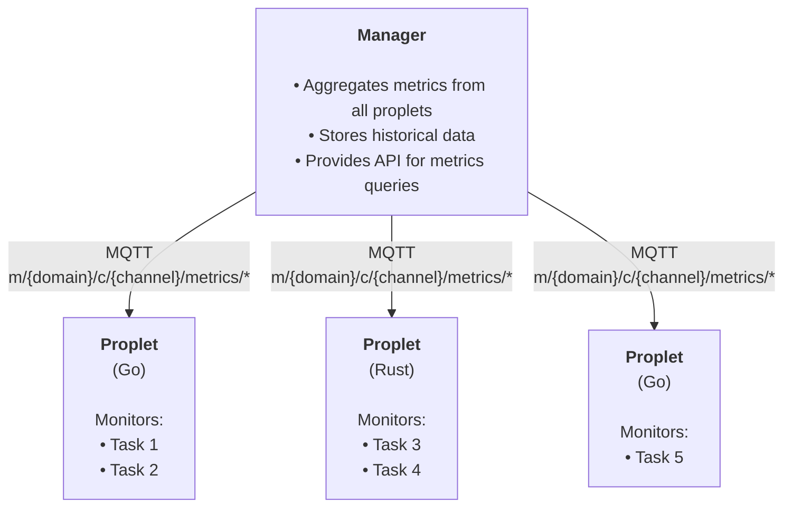

# Monitoring

## Overview

Propeller includes comprehensive OS-level process monitoring for workloads running on proplets. The monitoring system is cross-platform, supporting Linux, macOS, and Windows, and provides real-time visibility into resource utilization for distributed tasks.

Both the Go and Rust implementations of proplet include monitoring capabilities using battle-tested libraries (`gopsutil` for Go, `sysinfo` for Rust) to collect process-level metrics with minimal overhead.

## Architecture



## Features

### Metrics Collection

The monitoring system collects the following OS-level metrics:

- **CPU Usage**: Percentage of CPU time consumed by the process
- **Memory Usage**: Bytes and percentage of memory used
- **Disk I/O**: Total bytes read from and written to disk
- **Network I/O**: Total bytes received and transmitted over the network
- **Thread Count**: Number of OS threads in the process
- **File Descriptors**: Number of open file descriptors (Linux/macOS only)
- **Uptime**: Process runtime in seconds
- **Timestamp**: ISO 8601 timestamp for each metric sample

### Monitoring Profiles

Propeller provides pre-configured monitoring profiles optimized for different workload types. These profiles automatically adjust collection intervals, enabled metrics, and history retention to match the expected behavior of your tasks.

#### Standard Profile

```json
{
  "enabled": true,
  "interval": 10,
  "collect_cpu": true,
  "collect_memory": true,
  "collect_disk_io": true,
  "collect_network_io": true,
  "collect_threads": true,
  "collect_file_descriptors": true,
  "export_to_mqtt": true,
  "retain_history": true,
  "history_size": 100
}
```

- **Use Case**: General-purpose monitoring
- **Interval**: 10 seconds
- **Metrics**: All enabled
- **History**: Last 100 samples (~16 minutes)
- **Best for**: Short to medium-duration tasks

#### Minimal Profile

```json
{
  "enabled": true,
  "interval": 60,
  "collect_cpu": true,
  "collect_memory": true,
  "collect_disk_io": false,
  "collect_network_io": false,
  "collect_threads": false,
  "collect_file_descriptors": false,
  "export_to_mqtt": false,
  "retain_history": false,
  "history_size": 0
}
```

- **Use Case**: Minimal overhead monitoring
- **Interval**: 60 seconds
- **Metrics**: CPU and Memory only
- **History**: None
- **Best for**: Resource-constrained environments, lightweight tasks

#### Intensive Profile

```json
{
  "enabled": true,
  "interval": 1,
  "collect_cpu": true,
  "collect_memory": true,
  "collect_disk_io": true,
  "collect_network_io": true,
  "collect_threads": true,
  "collect_file_descriptors": true,
  "export_to_mqtt": true,
  "retain_history": true,
  "history_size": 1000
}
```

- **Use Case**: Debug and performance analysis
- **Interval**: 1 second
- **Metrics**: All enabled
- **History**: Last 1000 samples (~16 minutes)
- **Best for**: Development, troubleshooting, profiling

#### Batch Processing Profile

```json
{
  "enabled": true,
  "interval": 30,
  "collect_cpu": true,
  "collect_memory": true,
  "collect_disk_io": true,
  "collect_network_io": false,
  "collect_threads": false,
  "collect_file_descriptors": false,
  "export_to_mqtt": true,
  "retain_history": true,
  "history_size": 200
}
```

- **Use Case**: Data processing workloads
- **Interval**: 30 seconds
- **Metrics**: CPU, Memory, Disk I/O
- **History**: Last 200 samples (~100 minutes)
- **Best for**: ETL jobs, batch processors, data transformation

#### Real-time API Profile

```json
{
  "enabled": true,
  "interval": 5,
  "collect_cpu": true,
  "collect_memory": true,
  "collect_disk_io": false,
  "collect_network_io": true,
  "collect_threads": true,
  "collect_file_descriptors": true,
  "export_to_mqtt": true,
  "retain_history": true,
  "history_size": 500
}
```

- **Use Case**: HTTP/API servers and real-time services
- **Interval**: 5 seconds
- **Metrics**: CPU, Memory, Network, Threads, File Descriptors
- **History**: Last 500 samples (~41 minutes)
- **Best for**: Web servers, API gateways, real-time services

#### Long-running Daemon Profile

```json
{
  "enabled": true,
  "interval": 120,
  "collect_cpu": true,
  "collect_memory": true,
  "collect_disk_io": true,
  "collect_network_io": true,
  "collect_threads": true,
  "collect_file_descriptors": true,
  "export_to_mqtt": true,
  "retain_history": true,
  "history_size": 500
}
```

- **Use Case**: Background services and daemons
- **Interval**: 120 seconds
- **Metrics**: All enabled
- **History**: Last 500 samples (~16 hours)
- **Best for**: Long-running background processes, daemon tasks

## Configuration

### Global Configuration

Enable or disable monitoring globally using environment variables:

**Go Proplet:**

```bash
export PROPLET_ENABLE_MONITORING=true  # default: true
export PROPLET_METRICS_INTERVAL=10     # default: 10 seconds
```

**Rust Proplet:**

```bash
export PROPLET_ENABLE_MONITORING=true  # default: true
export PROPLET_METRICS_INTERVAL=10     # default: 10 seconds
```

### Per-Task Configuration

Specify a monitoring profile in your task request:

```json
{
  "id": "550e8400-e29b-41d4-a716-446655440001",
  "functionName": "compute",
  "imageURL": "registry.example.com/compute:v1",
  "params": [10, 20],
  "daemon": false,
  "monitoringProfile": {
    "enabled": true,
    "interval": 5,
    "collect_cpu": true,
    "collect_memory": true,
    "collect_disk_io": true,
    "collect_network_io": true,
    "collect_threads": true,
    "collect_file_descriptors": true,
    "export_to_mqtt": true,
    "retain_history": true,
    "history_size": 200
  }
}
```

### Automatic Profile Selection

If no monitoring profile is specified, Propeller automatically selects an appropriate profile based on the task type:

- **Non-daemon tasks**: Standard Profile (10-second intervals)
- **Daemon tasks**: Long-running Daemon Profile (120-second intervals)

## Usage Examples

### Example 1: Standard Monitoring

Submit a task with standard monitoring (auto-selected for non-daemon tasks):

```json
{
  "id": "550e8400-e29b-41d4-a716-446655440001",
  "functionName": "compute",
  "imageURL": "registry.example.com/compute:v1",
  "params": [10, 20],
  "daemon": false
}
```

The task automatically uses the **Standard Profile** with metrics collected every 10 seconds.

### Example 2: Long-running Daemon

Submit a long-running daemon task:

```json
{
  "id": "550e8400-e29b-41d4-a716-446655440002",
  "functionName": "process_stream",
  "imageURL": "registry.example.com/stream-processor:v1",
  "daemon": true
}
```

The task automatically uses the **Long-running Daemon Profile** with metrics collected every 120 seconds.

### Example 3: High-Frequency Debug Monitoring

For debugging with high-frequency monitoring:

```json
{
  "id": "550e8400-e29b-41d4-a716-446655440003",
  "functionName": "debug_task",
  "wasmFile": "<base64-encoded-wasm>",
  "params": [],
  "monitoringProfile": {
    "enabled": true,
    "interval": 1,
    "collect_cpu": true,
    "collect_memory": true,
    "collect_disk_io": true,
    "collect_network_io": true,
    "collect_threads": true,
    "collect_file_descriptors": true,
    "export_to_mqtt": true,
    "retain_history": true,
    "history_size": 1000
  }
}
```

Collects metrics every second with 1000-sample history (~16 minutes of data).

### Example 4: Minimal Overhead

For resource-constrained environments:

```json
{
  "id": "550e8400-e29b-41d4-a716-446655440004",
  "functionName": "lightweight_task",
  "imageURL": "registry.example.com/light:v1",
  "monitoringProfile": {
    "enabled": true,
    "interval": 60,
    "collect_cpu": true,
    "collect_memory": true,
    "collect_disk_io": false,
    "collect_network_io": false,
    "collect_threads": false,
    "collect_file_descriptors": false,
    "export_to_mqtt": false,
    "retain_history": false,
    "history_size": 0
  }
}
```

Collects only CPU and memory every 60 seconds with no MQTT export or history retention.

### Example 5: Batch Processing

For data processing tasks:

```json
{
  "id": "550e8400-e29b-41d4-a716-446655440005",
  "functionName": "process_batch",
  "imageURL": "registry.example.com/batch-processor:v1",
  "params": [1000],
  "env": {
    "BATCH_SIZE": "1000",
    "WORKERS": "4"
  },
  "monitoringProfile": {
    "enabled": true,
    "interval": 30,
    "collect_cpu": true,
    "collect_memory": true,
    "collect_disk_io": true,
    "collect_network_io": false,
    "collect_threads": false,
    "collect_file_descriptors": false,
    "export_to_mqtt": true,
    "retain_history": true,
    "history_size": 200
  }
}
```

### Example 6: Real-time API Server

For HTTP/API server workloads:

```json
{
  "id": "550e8400-e29b-41d4-a716-446655440006",
  "functionName": "serve_http",
  "imageURL": "registry.example.com/api-server:v1",
  "daemon": true,
  "env": {
    "PORT": "8080"
  },
  "monitoringProfile": {
    "enabled": true,
    "interval": 5,
    "collect_cpu": true,
    "collect_memory": true,
    "collect_disk_io": false,
    "collect_network_io": true,
    "collect_threads": true,
    "collect_file_descriptors": true,
    "export_to_mqtt": true,
    "retain_history": true,
    "history_size": 500
  }
}
```

## Metrics Export

### MQTT Topics

Metrics are published to MQTT topics for real-time monitoring and integration with external systems.

**Go Proplet:**

```txt
m/{domain_id}/c/{channel_id}/control/proplet/task_metrics
```

**Rust Proplet:**

```txt
m/{domain_id}/c/{channel_id}/metrics/proplet
```

### Message Format

```json
{
  "task_id": "550e8400-e29b-41d4-a716-446655440001",
  "proplet_id": "7c9e6679-7425-40de-944b-e07fc1f90ae7",
  "metrics": {
    "cpu_usage_percent": 23.5,
    "memory_usage_bytes": 52428800,
    "memory_usage_percent": 1.2,
    "disk_read_bytes": 1048576,
    "disk_write_bytes": 524288,
    "network_rx_bytes": 2048,
    "network_tx_bytes": 4096,
    "uptime_seconds": 45,
    "thread_count": 2,
    "file_descriptor_count": 8,
    "timestamp": "2025-01-15T10:35:22.123456Z"
  },
  "aggregated": {
    "avg_cpu_usage": 38.2,
    "max_cpu_usage": 65.0,
    "avg_memory_usage": 62914560,
    "max_memory_usage": 71303168,
    "total_disk_read": 2097152,
    "total_disk_write": 1048576,
    "total_network_rx": 12288,
    "total_network_tx": 24576,
    "sample_count": 24
  }
}
```

### Subscribing to Metrics

To receive metrics in real-time, subscribe to the metrics topic:

```bash
mosquitto_sub -h localhost -t "m/domain-123/c/channel-456/metrics/proplet" -v
```

Or subscribe to all metrics:

```bash
mosquitto_sub -h localhost -t "m/+/c/+/*/metrics" -v
```

## Platform Support

### Linux

Full support for all metrics:

- CPU usage via `/proc/[pid]/stat`
- Memory usage via `/proc/[pid]/status`
- Disk I/O via `/proc/[pid]/io`
- Network I/O via `/proc/[pid]/net/dev`
- Thread count via `/proc/[pid]/task`
- File descriptors via `/proc/[pid]/fd`

Example output:

```json
{
  "cpu_usage_percent": 25.3,
  "memory_usage_bytes": 67108864,
  "disk_read_bytes": 4194304,
  "disk_write_bytes": 2097152,
  "network_rx_bytes": 8192,
  "network_tx_bytes": 16384,
  "thread_count": 4,
  "file_descriptor_count": 15
}
```

### macOS

Full support for all metrics:

- CPU usage via system calls
- Memory usage via system APIs
- Disk I/O via system counters
- Network I/O via system APIs
- Thread count via system APIs
- File descriptors via `lsof` or system calls

Example output:

```json
{
  "cpu_usage_percent": 22.1,
  "memory_usage_bytes": 62914560,
  "disk_read_bytes": 3145728,
  "disk_write_bytes": 1572864,
  "network_rx_bytes": 6144,
  "network_tx_bytes": 12288,
  "thread_count": 3,
  "file_descriptor_count": 12
}
```

### Windows

Limited metrics support:

- CPU usage: Fully supported
- Memory usage: Fully supported
- Disk I/O: Supported
- Network I/O: Limited (may report 0)
- Thread count: Limited (often reports 1 due to library limitations)
- File descriptors: Not supported (always 0)

Example output:

```json
{
  "cpu_usage_percent": 28.7,
  "memory_usage_bytes": 71303168,
  "disk_read_bytes": 5242880,
  "disk_write_bytes": 2621440,
  "network_rx_bytes": 0,
  "network_tx_bytes": 0,
  "thread_count": 1,
  "file_descriptor_count": 0
}
```

## Integration with Monitoring Systems

### Prometheus

Export metrics to Prometheus using an MQTT-to-Prometheus bridge:

**prometheus.yml:**

```yaml
scrape_configs:
  - job_name: "propeller"
    static_configs:
      - targets: ["mqtt-exporter:9641"]
```

Use [mqtt2prometheus](https://github.com/hikhvar/mqtt2prometheus) or similar bridges.

### Grafana

Create dashboards to visualize:

- CPU usage over time (line chart)
- Memory consumption trends (area chart)
- Disk I/O rates (stacked area chart)
- Network throughput (line chart)
- Thread and file descriptor counts (gauge)
- Per-task resource comparison (bar chart)

Import the metrics from Prometheus or directly from MQTT.

## Performance Impact

The monitoring system is designed for minimal overhead:

| Profile   | CPU Overhead | Memory Overhead |
| --------- | ------------ | --------------- |
| Minimal   | < 0.1%       | ~1 MB           |
| Standard  | < 0.5%       | ~2 MB           |
| Intensive | < 2%         | ~5 MB           |

Memory overhead scales with history size:

- No history: ~1 MB
- 100 samples: ~2 MB
- 1000 samples: ~5 MB

## Troubleshooting

### No metrics appearing

1. Check if monitoring is enabled globally:

   ```bash
   echo $PROPLET_ENABLE_MONITORING
   ```

2. Verify MQTT connection:

   ```bash
   mosquitto_sub -h localhost -t "m/+/c/+/metrics/#" -v
   ```

3. Check task monitoring profile in task request:

   ```json
   {
     "monitoringProfile": {
       "enabled": true,
       "export_to_mqtt": true
     }
   }
   ```

4. Check proplet logs for monitoring errors

### High overhead

Reduce monitoring frequency and disable unnecessary metrics:

```json
{
  "monitoringProfile": {
    "interval": 60,
    "collect_disk_io": false,
    "collect_network_io": false,
    "retain_history": false
  }
}
```

### Missing metrics on Windows

Some metrics have limited support on Windows. Consider:

- Using Linux/macOS for full metric support
- Implementing platform-specific monitoring
- Accepting reduced metrics on Windows

### Metrics not published to MQTT

1. Verify MQTT broker is running:

   ```bash
   docker ps | grep mosquitto
   ```

2. Check proplet MQTT configuration
3. Ensure `export_to_mqtt: true` in monitoring profile
4. Check network connectivity between proplet and MQTT broker

### High memory usage

Reduce history size or disable history retention:

```json
{
  "monitoringProfile": {
    "retain_history": false,
    "history_size": 0
  }
}
```

### Inaccurate CPU metrics

CPU usage is measured as a percentage over the collection interval. For accurate readings:

- Use intervals of at least 1 second
- Ensure the process is CPU-bound (not I/O-bound)
- Consider platform-specific CPU measurement limitations

## API Reference

### MonitoringProfile Structure

```json
{
  "enabled": true, // Enable/disable monitoring
  "interval": 10, // Collection interval in seconds
  "collect_cpu": true, // Collect CPU usage
  "collect_memory": true, // Collect memory usage
  "collect_disk_io": true, // Collect disk I/O
  "collect_network_io": true, // Collect network I/O
  "collect_threads": true, // Collect thread count
  "collect_file_descriptors": true, // Collect file descriptor count
  "export_to_mqtt": true, // Export to MQTT
  "retain_history": true, // Retain historical samples
  "history_size": 100 // Number of samples to retain
}
```

### Metrics Structure

```json
{
  "cpu_usage_percent": 23.5, // CPU usage percentage (0-100+)
  "memory_usage_bytes": 52428800, // Memory usage in bytes
  "memory_usage_percent": 1.2, // Memory usage percentage (0-100)
  "disk_read_bytes": 1048576, // Cumulative disk bytes read
  "disk_write_bytes": 524288, // Cumulative disk bytes written
  "network_rx_bytes": 2048, // Cumulative network bytes received
  "network_tx_bytes": 4096, // Cumulative network bytes transmitted
  "uptime_seconds": 45, // Process uptime in seconds
  "thread_count": 2, // Number of threads
  "file_descriptor_count": 8, // Number of open file descriptors
  "timestamp": "2025-01-15T10:35:22Z" // ISO 8601 timestamp
}
```

### Aggregated Metrics Structure

```json
{
  "avg_cpu_usage": 38.2, // Average CPU usage
  "max_cpu_usage": 65.0, // Maximum CPU usage
  "avg_memory_usage": 62914560, // Average memory usage
  "max_memory_usage": 71303168, // Maximum memory usage
  "total_disk_read": 2097152, // Total disk bytes read
  "total_disk_write": 1048576, // Total disk bytes written
  "total_network_rx": 12288, // Total network bytes received
  "total_network_tx": 24576, // Total network bytes transmitted
  "sample_count": 24 // Number of samples in aggregation
}
```

## Getting Started

### Prerequisites

1. Start the Propeller infrastructure:

   ```bash
   docker compose up -d
   ```

2. Start proplet with monitoring enabled:

   **Go Proplet:**

   ```bash
   export PROPLET_ENABLE_MONITORING=true
   export PROPLET_METRICS_INTERVAL=10
   ./build/proplet
   ```

   **Rust Proplet:**

   ```bash
   export PROPLET_ENABLE_MONITORING=true
   export PROPLET_METRICS_INTERVAL=5
   export PROPLET_DOMAIN_ID=domain-123
   export PROPLET_CHANNEL_ID=channel-456
   export PROPLET_CLIENT_ID=proplet-rs-001
   export PROPLET_CLIENT_KEY=secret
   cargo run --release
   ```

3. Subscribe to metrics:

   ```bash
   mosquitto_sub -h localhost -t "m/+/c/+/metrics/#" -v
   ```

4. Submit a task with monitoring:

   ```json
   {
     "id": "test-task",
     "functionName": "compute",
     "imageURL": "registry.example.com/compute:v1",
     "monitoringProfile": {
       "enabled": true,
       "interval": 5,
       "export_to_mqtt": true
     }
   }
   ```

5. Observe metrics in real-time
