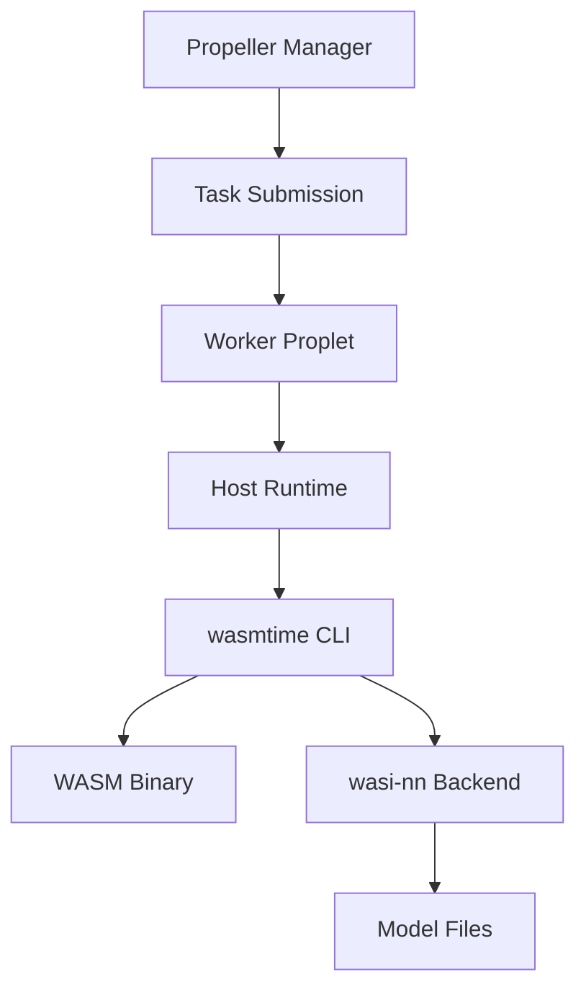

# Running wasi-nn Examples on Propeller

This guide explains how to run WebAssembly Neural Network (`wasi-nn`) examples from Wasmtime on Propeller's WASM execution platform.

## Table of Contents

1. [Conceptual Overview](#conceptual-overview)
2. [Propeller Integration](#propeller-integration)
3. [Prerequisites](#prerequisites)
4. [Step-by-Step Execution Flow](#step-by-step-execution-flow)
5. [Concrete Commands](#concrete-commands)
6. [Platform-Specific Notes](#platform-specific-notes)
7. [Troubleshooting](#troubleshooting)

---

## Conceptual Overview

### How wasi-nn Works

**wasi-nn** is a WASI proposal that provides machine learning inference capabilities to WebAssembly programs. It follows a "graph loader" API design, allowing programs to:

1. **Load Models**: Load pre-trained ML models in a format-agnostic way
2. **Bind Inputs**: Provide input tensors to the model
3. **Execute Inference**: Run the model to perform inference
4. **Retrieve Outputs**: Extract output tensors from the model

**Key Components:**

- **Models**: Pre-trained ML models in backend-specific formats (e.g., OpenVINO IR, ONNX)
- **Backends**: Runtime implementations that execute the models (e.g., OpenVINO, ONNX Runtime)
- **Graph Execution**: The sequence of loading → binding inputs → executing → retrieving outputs
- **System Interface**: Exposed via WASI functions like `load`, `set_input`, `compute`, `get_output`

**Model Loading Flow:**


**Inference Flow:**


### Mapping to Propeller's WASM Execution Environment

Propeller executes WASM workloads through:

1. **Manager**: Schedules tasks and distributes them to workers
2. **Workers (Proplets)**: Execute WASM binaries using configured runtimes
3. **Runtimes**:
   - **Wazero** (Go): Default embedded runtime
   - **Wasmtime** (Rust): Available in `proplet-rs`
   - **Host Runtime**: External runtime (e.g., `wasmtime` CLI) - **Required for wasi-nn**

**Why Host Runtime?**

wasi-nn support requires Wasmtime's experimental wasi-nn module, which is only available when using Wasmtime directly (not through Wazero). The host runtime allows Propeller to execute WASM using an external `wasmtime` binary with wasi-nn enabled.

**Execution Model:**



### Constraints and Assumptions

**Supported Backends:**
- **OpenVINO**: Currently the primary tested backend (version 2022.1.0.643 or later)
- Other backends (ONNX Runtime, TensorFlow) may work but are less tested

**Model Formats:**
- Models must be pre-compiled to the backend format (e.g., OpenVINO IR: `.xml` + `.bin` pair)
- Format conversion must happen offline; wasi-nn does not perform conversion at runtime

**File Access:**
- Model files must be accessible to the Propeller worker
- Models can be:
  - Pre-staged on worker filesystem
  - Mounted via volume mounts (Docker/Kubernetes)
  - Referenced via environment variables or absolute paths

**Runtime Requirements:**
- Wasmtime must be installed on the worker with wasi-nn support
- OpenVINO runtime libraries must be installed on the worker (if using OpenVINO backend)
- Worker must be configured to use the host runtime with `wasmtime` as the external runtime

---

## Propeller Integration

### Architecture Overview

When running wasi-nn workloads on Propeller:

1. **Task Creation**: WASM binary is uploaded to Propeller manager
2. **Task Scheduling**: Manager selects an appropriate worker
3. **Task Execution**: Worker receives task and:
   - Writes WASM binary to temporary file
   - Executes `wasmtime` CLI with wasi-nn flags
   - Passes environment variables for model paths
   - Captures stdout/stderr for results
4. **Result Retrieval**: Worker publishes results back to manager

### Host Runtime Configuration

The host runtime in Propeller executes WASM by:

1. Writing the WASM binary to a temporary file: `{task-id}.wasm`
2. Constructing a command: `wasmtime [CLIArgs] {task-id}.wasm [Args]`
3. Setting environment variables from `Env` map
4. Capturing stdout/stderr and publishing results

**For wasi-nn, configure:**
- `CLIArgs`: `["-S", "nn", "--dir=fixture"]` (see note below about Wasmtime versions)
- `Env`: Library path and model directory (platform-specific, see below)
- `FunctionName`: Not used by host runtime (wasmtime executes the WASM directly)

> **Important - Wasmtime Version Differences:**  
> The wasi-nn flags have changed in recent Wasmtime versions:
> - **Wasmtime 0.40-13.x**: `--wasi-modules=experimental-wasi-nn`
> - **Wasmtime 14.0+**: `-S nn=y`
> 
> Check your Wasmtime version: `wasmtime --version`  
> See available options: `wasmtime run -S help`

### Task Structure

A Propeller task for wasi-nn includes:

```json
{
  "name": "wasi-nn-inference",
  "file": "<base64-encoded-wasm-binary>",
  "cli_args": ["-S", "nn", "--dir=fixture"],
  "env": {
    "MODEL_DIR": "/models",
    "DYLD_LIBRARY_PATH": "/opt/homebrew/lib"
  },
  "daemon": false
}
```

> **Note:** The `cli_args` must be an array with separate elements. Do not combine multiple flags into a single string.

---

## Prerequisites

### Development Machine

1. **Rust Toolchain** with `wasm32-wasip1` target:
   ```bash
   # Install Rust if not already installed
   curl --proto '=https' --tlsv1.2 -sSf https://sh.rustup.rs | sh

   # Add WASI target (note: wasm32-wasi was renamed to wasm32-wasip1)
   rustup target add wasm32-wasip1

   # Verify installation
   rustc --version
   rustup target list | grep wasm32-wasip1
   ```

2. **Wasmtime Repository** (for examples):
   ```bash
   # Clone the repository
   git clone https://github.com/bytecodealliance/wasmtime.git

   # Navigate to wasi-nn examples
   cd wasmtime/crates/wasi-nn/examples

   # Verify examples exist
   ls -la
   ```

3. **Wasmtime CLI** with wasi-nn support:
   ```bash
   # Option 1: Build from source with wasi-nn support
   cd wasmtime
   cargo build --release --features wasi-nn
   # Binary will be at: target/release/wasmtime

   # Option 2: Use pre-installed wasmtime (check for wasi-nn support)
   wasmtime run -S help | grep nn
   # Should show: -S nn[=y|n] -- Enable support for WASI neural network imports

   # Verify wasmtime version
   wasmtime --version
   ```

### Propeller Worker Machine

1. **Wasmtime CLI** installed and in PATH:
   ```bash
   which wasmtime
   wasmtime --version
   
   # Verify wasi-nn support
   wasmtime run -S help | grep nn
   ```

2. **OpenVINO Runtime** (if using OpenVINO backend):
   
   **Linux:**
   ```bash
   # Install OpenVINO (follow official docs)
   # Ensure libraries are in LD_LIBRARY_PATH
   export LD_LIBRARY_PATH=/opt/intel/openvino/runtime/lib:$LD_LIBRARY_PATH
   
   # Verify installation
   ldconfig -p | grep openvino
   ```
   
   **macOS:**
   ```bash
   # Install via Homebrew
   brew install openvino
   
   # Libraries will be at /opt/homebrew/lib
   export DYLD_LIBRARY_PATH=/opt/homebrew/lib
   
   # Verify installation
   ls /opt/homebrew/lib | grep openvino
   ```

3. **Propeller Worker** configured with:
   - Host runtime enabled
   - `EXTERNAL_WASM_RUNTIME` environment variable set to `wasmtime`
   - Proper MQTT credentials provisioned in SuperMQ

4. **Model Files** staged on worker:
   - Models in OpenVINO IR format (`.xml` + `.bin`)
   - Accessible at a known path (e.g., `/models`)
   - Example: Download MobileNet model:
   ```bash
   mkdir -p ~/models
   cd ~/models
   curl -LO https://github.com/intel/openvino-rs/raw/main/crates/openvino/tests/mobilenet/mobilenet.xml
   curl -LO https://github.com/intel/openvino-rs/raw/main/crates/openvino/tests/mobilenet/mobilenet.bin
   ```

---

## Step-by-Step Execution Flow

### Phase 1: Build wasi-nn WASM Binaries

**Location**: `wasmtime/crates/wasi-nn/examples/`

**Available Examples**:
- `classification-example/`: Image classification using MobileNet
- `classification-component-onnx/`: ONNX-based classification
- `classification-example-pytorch/`: PyTorch models

**Build Process:**

```bash
# Navigate to classification example
cd wasmtime/crates/wasi-nn/examples/classification-example

# Build for WASM target (note: use wasm32-wasip1, not wasm32-wasi)
cargo build --target wasm32-wasip1 --release

# Verify output
ls -lh target/wasm32-wasip1/release/*.wasm
# Should show: wasi-nn-example.wasm
```

### Phase 2: Prepare Model Artifacts

**Model Requirements:**
- Format: OpenVINO IR (`.xml` + `.bin` pair)
- Location: Accessible to Propeller worker

**Complete Setup:**

```bash
# 1. Create fixture directory
cd wasmtime/crates/wasi-nn/examples/classification-example
mkdir -p fixture

# 2. Download MobileNet model files
wget https://download.01.org/openvinotoolkit/fixtures/mobilenet/mobilenet.xml -O fixture/model.xml
wget https://download.01.org/openvinotoolkit/fixtures/mobilenet/mobilenet.bin -O fixture/model.bin

# 3. Download input tensor (test image data)
wget https://download.01.org/openvinotoolkit/fixtures/mobilenet/tensor-1x224x224x3-f32.bgr -O fixture/tensor.bgr

# 4. Verify all files
ls -lh fixture/
# Should show: model.xml, model.bin, tensor.bgr
```

**Model Path Convention:**
- The example code looks for models in the `fixture/` directory
- This directory must be mapped to the WASM module via `--dir=fixture` flag
- Models are accessed as `fixture/model.xml` and `fixture/model.bin` from within WASM

### Phase 3: Test Locally (Before Propeller)

**Verify wasi-nn Support:**

```bash
# Check wasmtime version and wasi-nn support
wasmtime --version
wasmtime run -S help | grep nn

# Should show output like:
# -S nn[=y|n] -- Enable support for WASI neural network imports
```

**Run Local Test:**

```bash
cd wasmtime/crates/wasi-nn/examples/classification-example

# Execute with wasi-nn enabled (Wasmtime 14.0+)
wasmtime run -S nn --dir=fixture target/wasm32-wasip1/release/wasi-nn-example.wasm

# For older Wasmtime versions (0.40-13.x):
# wasmtime --wasi-modules=experimental-wasi-nn --dir=fixture target/wasm32-wasip1/release/wasi-nn-example.wasm
```

**Expected Output:**
```
Read graph XML, first 50 characters: <?xml version="1.0" ?>
<net name="mobilenet_v2_1.0
Read graph weights, size in bytes: 13956476
Loaded graph into wasi-nn with ID: 0
Created wasi-nn execution context with ID: 0
Read input tensor, size in bytes: 602112
Executed graph inference
Found results, sorted top 5: [InferenceResult(904, 0.4025879), InferenceResult(885, 0.3581543), ...]
```

### Phase 4: Configure Propeller Worker

#### SuperMQ Provisioning

Propeller requires valid SuperMQ credentials for MQTT communication:

```bash
# Navigate to Propeller directory
cd /path/to/propeller

# Run provisioning (creates domain, channels, and clients in SuperMQ)
propeller-cli provision

# This generates a config.toml file with:
# - manager credentials
# - proplet credentials  
# - proxy credentials
```

#### Configuration Methods

**Choose ONE of these methods:**

**Method A: Environment Variables (Recommended for Docker Compose)**

Update your `.env` file with values from the generated `config.toml`:

```bash
# Manager Configuration
MANAGER_DOMAIN_ID="016fd903-9dda-4f14-b12c-566cfa685698"
MANAGER_CHANNEL_ID="6ed13fba-bd73-4a12-9e92-6251763374c4"
MANAGER_CLIENT_ID="5c02f237-c252-435e-b75c-4132a9cf885a"
MANAGER_CLIENT_KEY="51d62814-21e3-4857-8f4d-5e41e26eadd9"

# Proplet Configuration
PROPLET_DOMAIN_ID="016fd903-9dda-4f14-b12c-566cfa685698"
PROPLET_CHANNEL_ID="6ed13fba-bd73-4a12-9e92-6251763374c4"
PROPLET_CLIENT_ID="38a244df-6081-4b11-9437-847a825c7cec"
PROPLET_CLIENT_KEY="6c1d3f6c-267d-4b1c-8407-7882ae9577c3"
PROPLET_EXTERNAL_WASM_RUNTIME="wasmtime"

# Proxy Configuration
PROXY_DOMAIN_ID="016fd903-9dda-4f14-b12c-566cfa685698"
PROXY_CHANNEL_ID="6ed13fba-bd73-4a12-9e92-6251763374c4"
PROXY_CLIENT_ID="38a244df-6081-4b11-9437-847a825c7cec"
PROXY_CLIENT_KEY="6c1d3f6c-267d-4b1c-8407-7882ae9577c3"
```

**Important:** Comment out config file variables:
```bash
# PROPLET_CONFIG_FILE=""  # Comment out
# PROPLET_CONFIG_SECTION=""  # Comment out
```

**Method B: Config File**

Use the generated `config.toml` directly:

```bash
# Set environment variables to point to config file
PROPLET_CONFIG_FILE="/config.toml"
PROPLET_CONFIG_SECTION="proplet"
```

> **Warning:** Do not mix both methods! Choose environment variables OR config file, not both. Mixing them causes credential conflicts.

#### Docker Compose Configuration

**Example `compose.yaml` snippet for proplet:**

```yaml
proplet:
  image: ghcr.io/absmach/propeller/proplet:latest
  container_name: propeller-proplet
  restart: on-failure
  depends_on:
    - mqtt-adapter
  ports:
    - 8082:8081
  environment:
    PROPLET_LOG_LEVEL: ${PROPLET_LOG_LEVEL}
    PROPLET_MQTT_ADDRESS: ${PROPLET_MQTT_ADDRESS}
    PROPLET_MQTT_QOS: ${PROPLET_MQTT_QOS}
    PROPLET_MQTT_TIMEOUT: ${PROPLET_MQTT_TIMEOUT}
    PROPLET_LIVELINESS_INTERVAL: ${PROPLET_LIVELINESS_INTERVAL}
    PROPLET_DOMAIN_ID: ${PROPLET_DOMAIN_ID}
    PROPLET_CHANNEL_ID: ${PROPLET_CHANNEL_ID}
    PROPLET_CLIENT_ID: ${PROPLET_CLIENT_ID}
    PROPLET_CLIENT_KEY: ${PROPLET_CLIENT_KEY}
    PROPLET_EXTERNAL_WASM_RUNTIME: ${PROPLET_EXTERNAL_WASM_RUNTIME}
    # Platform-specific: Use DYLD_LIBRARY_PATH on macOS, LD_LIBRARY_PATH on Linux
    DYLD_LIBRARY_PATH: "/opt/homebrew/lib"  # macOS
    # LD_LIBRARY_PATH: "/usr/local/lib"  # Linux
  networks:
    - supermq-base-net
  volumes:
    # Mount models directory (use absolute paths)
    - /Users/username/models:/models
    # Mount fixture directory for the example
    - /Users/username/wasmtime/crates/wasi-nn/examples/classification-example/fixture:/fixture
    # Optional: Mount config file if using Method B
    # - ./config.toml:/config.toml
```

**Key Configuration Points:**
- Use absolute paths for volume mounts (relative paths may fail)
- Set the correct library path variable for your platform (see Platform-Specific Notes)
- Ensure `EXTERNAL_WASM_RUNTIME` is set to `wasmtime`
- Make sure all credentials match between `.env` and `config.toml` (if using both)

#### Verify Worker Setup

```bash
# 1. Check wasmtime is available
which wasmtime
wasmtime run -S help | grep nn

# 2. Check OpenVINO (macOS)
ls /opt/homebrew/lib | grep openvino

# 3. Check OpenVINO (Linux)
ldconfig -p | grep openvino

# 4. Start Propeller services
docker compose up -d

# 5. Verify proplet is running and registered
docker compose logs proplet | grep "Starting Proplet"
docker compose logs manager | grep "successfully created proplet"
```

### Phase 5: Submit Task to Propeller

**Via Propeller CLI and API:**

```bash
# Navigate to your WASM binary location
cd wasmtime/crates/wasi-nn/examples/classification-example

# 1. Create task
propeller-cli tasks create wasi-nn-inference

# 2. Save task ID from output
TASK_ID="<id-from-create-output>"

# 3. Encode WASM binary to base64
# macOS:
WASM_B64=$(base64 -i target/wasm32-wasip1/release/wasi-nn-example.wasm | tr -d '\n')

# Linux:
# WASM_B64=$(base64 -w 0 target/wasm32-wasip1/release/wasi-nn-example.wasm)

# 4. Update task with WASM binary and configuration
curl -X PUT http://localhost:7070/tasks/$TASK_ID \
  -H "Content-Type: application/json" \
  -d "{
    \"name\": \"wasi-nn-inference\",
    \"file\": \"$WASM_B64\",
    \"cli_args\": [\"-S\", \"nn\", \"--dir=fixture\"],
    \"env\": {
      \"DYLD_LIBRARY_PATH\": \"/opt/homebrew/lib\"
    },
    \"daemon\": false
  }"

# 5. Verify task was updated
curl -s http://localhost:7070/tasks/$TASK_ID | jq '.name, .state'

# 6. Start task
propeller-cli tasks start $TASK_ID

# 7. Check execution logs
docker compose logs proplet --tail 50
```

> **Platform Note:** Adjust the `env` section based on your platform:
> - **macOS**: `"DYLD_LIBRARY_PATH": "/opt/homebrew/lib"`
> - **Linux**: `"LD_LIBRARY_PATH": "/usr/local/lib"` (or your OpenVINO installation path)

### Phase 6: Monitor Execution

**Check Task Status:**

```bash
# View task details
propeller-cli tasks view $TASK_ID

# Watch for task completion
watch -n 1 "propeller-cli tasks view $TASK_ID | jq '.state'"
```

**Task States:**
- `0`: Created
- `1`: Pending
- `2`: Running
- `3`: Completed
- `4`: Failed

**View Logs:**

```bash
# Proplet execution logs
docker compose logs proplet --tail 100 | grep -v DEBUG

# Manager logs
docker compose logs manager --tail 50

# MQTT adapter logs (for connectivity issues)
docker compose logs mqtt-adapter --tail 50
```

**Retrieve Results:**

```bash
# Get task with results
curl -s http://localhost:7070/tasks/$TASK_ID | jq '.results'

# Or via CLI
propeller-cli tasks view $TASK_ID
```

---

## Platform-Specific Notes

### macOS (Apple Silicon - M1/M2/M3)

**Library Path Variable:**
```bash
# macOS uses DYLD_LIBRARY_PATH (not LD_LIBRARY_PATH)
export DYLD_LIBRARY_PATH=/opt/homebrew/lib
```

**Base64 Encoding:**
```bash
# macOS base64 requires -i flag
WASM_B64=$(base64 -i file.wasm | tr -d '\n')

# The -w flag (line wrapping) doesn't exist on macOS base64
```

**OpenVINO Installation:**
```bash
# Install via Homebrew
brew install openvino

# Libraries location
/opt/homebrew/lib/libopenvino*.dylib

# Verify
ls /opt/homebrew/lib | grep openvino
```

**Docker Platform Warning:**

You may see this warning:
```
The requested image's platform (linux/amd64) does not match the detected host platform (linux/arm64/v8)
```

This is normal - Docker will use emulation (Rosetta 2). For production, consider building ARM64 images:
```bash
docker buildx build --platform linux/arm64 -t propeller/proplet:latest .
```

**WASI Target:**
```bash
# Use wasm32-wasip1 (wasm32-wasi was renamed)
rustup target add wasm32-wasip1
cargo build --target wasm32-wasip1 --release
```

### Linux

**Library Path Variable:**
```bash
# Linux uses LD_LIBRARY_PATH
export LD_LIBRARY_PATH=/opt/intel/openvino/runtime/lib:$LD_LIBRARY_PATH
```

**Base64 Encoding:**
```bash
# Linux base64 uses -w flag for line wrapping
WASM_B64=$(base64 -w 0 file.wasm)
```

**OpenVINO Installation:**
```bash
# Follow official OpenVINO docs for Linux installation
# https://docs.openvino.ai/latest/openvino_docs_install_guides_installing_openvino_linux.html

# Verify installation
ldconfig -p | grep openvino
```

**File Permissions:**
```bash
# Ensure model files are readable
chmod -R 755 /models
ls -l /models
```

### Configuration Compatibility Matrix

| Platform | Library Path Var | Base64 Flag | OpenVINO Path |
|----------|-----------------|-------------|---------------|
| macOS (Intel) | `DYLD_LIBRARY_PATH` | `-i` | `/usr/local/lib` |
| macOS (Apple Silicon) | `DYLD_LIBRARY_PATH` | `-i` | `/opt/homebrew/lib` |
| Linux | `LD_LIBRARY_PATH` | `-w 0` | `/opt/intel/openvino/runtime/lib` |

---

## Concrete Commands

### Complete Workflow Example (macOS)

```bash
# ====================
# Phase 1: Build WASM
# ====================

# Clone and build
git clone https://github.com/bytecodealliance/wasmtime.git
cd wasmtime/crates/wasi-nn/examples/classification-example

# Add WASI target
rustup target add wasm32-wasip1

# Build
cargo build --target wasm32-wasip1 --release

# Verify
ls -lh target/wasm32-wasip1/release/wasi-nn-example.wasm

# ====================
# Phase 2: Prepare Models
# ====================

# Create fixture and download files
mkdir -p fixture
cd fixture

# Download model files
curl -LO https://github.com/intel/openvino-rs/raw/main/crates/openvino/tests/mobilenet/mobilenet.xml
curl -LO https://github.com/intel/openvino-rs/raw/main/crates/openvino/tests/mobilenet/mobilenet.bin

# Rename for the example
mv mobilenet.xml model.xml
mv mobilenet.bin model.bin

# Download input tensor
curl -LO https://download.01.org/openvinotoolkit/fixtures/mobilenet/tensor-1x224x224x3-f32.bgr

# Verify all files
ls -lh
cd ..

# ====================
# Phase 3: Test Locally
# ====================

# Install OpenVINO (if not already installed)
brew install openvino

# Set library path
export DYLD_LIBRARY_PATH=/opt/homebrew/lib

# Test execution
wasmtime run -S nn --dir=fixture target/wasm32-wasip1/release/wasi-nn-example.wasm

# Should see inference results

# ====================
# Phase 4: Configure Propeller
# ====================

# Navigate to Propeller directory
cd /path/to/propeller

# Provision SuperMQ credentials
propeller-cli provision

# This creates config.toml - copy values to .env file

# Update docker/compose.yaml with correct volume mounts:
# volumes:
#   - /Users/username/wasmtime/crates/wasi-nn/examples/classification-example/fixture:/fixture
#   - /Users/username/models:/models  # if models are separate

# Start Propeller services
cd docker
docker compose up -d

# Verify proplet registered
sleep 10
docker compose logs manager | grep "successfully created proplet"

# ====================
# Phase 5: Submit Task
# ====================

cd /path/to/wasmtime/crates/wasi-nn/examples/classification-example

# Create task
propeller-cli tasks create wasi-nn-demo

# Set task ID
TASK_ID="<id-from-output>"

# Encode WASM
WASM_B64=$(base64 -i target/wasm32-wasip1/release/wasi-nn-example.wasm | tr -d '\n')

# Update task
curl -X PUT http://localhost:7070/tasks/$TASK_ID \
  -H "Content-Type: application/json" \
  -d "{
    \"name\": \"wasi-nn-demo\",
    \"file\": \"$WASM_B64\",
    \"cli_args\": [\"-S\", \"nn\", \"--dir=fixture\"],
    \"env\": {\"DYLD_LIBRARY_PATH\": \"/opt/homebrew/lib\"},
    \"daemon\": false
  }"

# Start task
propeller-cli tasks start $TASK_ID

# ====================
# Phase 6: Monitor
# ====================

# Check proplet logs
docker compose logs proplet --tail 100 | grep -v DEBUG

# View task status
propeller-cli tasks view $TASK_ID

# Get results
curl -s http://localhost:7070/tasks/$TASK_ID | jq '.results'
```

### Complete Workflow Example (Linux)

```bash
# ====================
# Phase 1: Build WASM
# ====================

# Clone and build
git clone https://github.com/bytecodealliance/wasmtime.git
cd wasmtime/crates/wasi-nn/examples/classification-example

# Add WASI target
rustup target add wasm32-wasip1

# Build
cargo build --target wasm32-wasip1 --release

# ====================
# Phase 2: Prepare Models
# ====================

mkdir -p fixture
cd fixture

# Download model files
wget https://github.com/intel/openvino-rs/raw/main/crates/openvino/tests/mobilenet/mobilenet.xml -O model.xml
wget https://github.com/intel/openvino-rs/raw/main/crates/openvino/tests/mobilenet/mobilenet.bin -O model.bin
wget https://download.01.org/openvinotoolkit/fixtures/mobilenet/tensor-1x224x224x3-f32.bgr

cd ..

# ====================
# Phase 3: Test Locally
# ====================

# Install OpenVINO (follow official docs)
# Set library path
export LD_LIBRARY_PATH=/opt/intel/openvino/runtime/lib:$LD_LIBRARY_PATH

# Test execution
wasmtime run -S nn --dir=fixture target/wasm32-wasip1/release/wasi-nn-example.wasm

# ====================
# Phase 4: Configure Propeller
# ====================

cd /path/to/propeller
propeller-cli provision

# Update .env with provisioned credentials
# Update docker/compose.yaml with volume mounts

cd docker
docker compose up -d

# ====================
# Phase 5: Submit Task
# ====================

cd /path/to/wasmtime/crates/wasi-nn/examples/classification-example

propeller-cli tasks create wasi-nn-demo
TASK_ID="<id-from-output>"

# Linux base64 syntax
WASM_B64=$(base64 -w 0 target/wasm32-wasip1/release/wasi-nn-example.wasm)

curl -X PUT http://localhost:7070/tasks/$TASK_ID \
  -H "Content-Type: application/json" \
  -d "{
    \"name\": \"wasi-nn-demo\",
    \"file\": \"$WASM_B64\",
    \"cli_args\": [\"-S\", \"nn\", \"--dir=fixture\"],
    \"env\": {\"LD_LIBRARY_PATH\": \"/opt/intel/openvino/runtime/lib\"},
    \"daemon\": false
  }"

propeller-cli tasks start $TASK_ID

# ====================
# Phase 6: Monitor
# ====================

docker compose logs proplet --tail 100
propeller-cli tasks view $TASK_ID
```

---

## Troubleshooting

### Common Issues and Solutions

#### 1. wasi-nn module not recognized

**Symptom:**
```
Error: unknown flag: --wasi-modules
```

or

```
Error: unknown flag: -S
```

**Cause:** Wasmtime version doesn't support the flag syntax used, or wasi-nn feature not compiled in.

**Solution:**

```bash
# Check Wasmtime version
wasmtime --version

# Check available WASI options
wasmtime run -S help

# Verify wasi-nn support
wasmtime run -S help | grep nn

# If not present, rebuild Wasmtime with wasi-nn:
cd /path/to/wasmtime
cargo clean
cargo build --release --features wasi-nn
```

#### 2. Model files not found

**Symptom:**
```
Error: failed to load model: file not found
```

or

```
Error: failed to open fixture/model.xml
```

**Cause:** Model files not accessible to the WASM module, or incorrect path mapping.

**Solution:**

```bash
# Verify model files exist
ls -lh fixture/model.xml fixture/model.bin

# Verify volume mounts in compose.yaml
docker compose config | grep -A 5 volumes

# Check proplet can access files
docker compose exec proplet ls -la /fixture

# Ensure --dir flag is included
# cli_args: ["-S", "nn", "--dir=fixture"]
```

#### 3. OpenVINO backend not available

**Symptom:**
```
Error: Failed while accessing backend
```

or

```
Error: backend not available
```

**Cause:** OpenVINO libraries not found or not in library path.

**Solution:**

**macOS:**
```bash
# Verify OpenVINO installation
ls /opt/homebrew/lib | grep openvino

# Set library path
export DYLD_LIBRARY_PATH=/opt/homebrew/lib

# Test locally first
wasmtime run -S nn --dir=fixture wasi-nn-example.wasm

# In compose.yaml, add:
# environment:
#   DYLD_LIBRARY_PATH: "/opt/homebrew/lib"
```

**Linux:**
```bash
# Verify OpenVINO installation
ldconfig -p | grep openvino

# Set library path
export LD_LIBRARY_PATH=/opt/intel/openvino/runtime/lib:$LD_LIBRARY_PATH

# In compose.yaml, add:
# environment:
#   LD_LIBRARY_PATH: "/opt/intel/openvino/runtime/lib"
```

#### 4. MQTT Connection Issues - "client_id not found"

**Symptom:**
```
{"level":"WARN","msg":"failed to proxy from MQTT broker to client with id  with error: client_id not found"}
```

**Cause:** The client IDs in configuration don't exist in SuperMQ database.

**Solution:**

```bash
# 1. Re-provision to create fresh clients
cd /path/to/propeller
propeller-cli provision

# 2. Verify clients were created in SuperMQ
TOKEN=$(curl -s -X POST http://localhost:9002/users/tokens/issue \
  -H "Content-Type: application/json" \
  -d '{"identity": "admin@example.com", "secret": "12345678"}' \
  | jq -r '.access_token')

curl -s http://localhost:9006/clients/YOUR_CLIENT_ID \
  -H "Authorization: Bearer $TOKEN" | jq

# 3. Update .env file with new client IDs from config.toml
# Ensure EXACT match between .env and config.toml

# 4. Restart services
docker compose down
docker compose up -d
```

#### 5. Manager Not Seeing Proplet - "entity already exists"

**Symptom:**
```
{"level":"WARN","msg":"Failed to handle MQTT message: entity already exists"}
```

**Cause:** Manager's proplet registry is in a stale state.

**Solution:**

```bash
# Restart manager to clear registry
docker compose restart manager

# Wait for proplet to re-register
sleep 10

# Verify registration
docker compose logs manager | grep "successfully created proplet"
# Should see: {"level":"INFO","msg":"successfully created proplet"}
```

#### 6. Task Starts But Proplet Doesn't Execute

**Symptom:**
- Manager logs: "Starting task completed successfully"
- Proplet logs: No execution logs, only liveliness messages

**Cause:** Task message not reaching proplet, or proplet not subscribed to correct topic.

**Solution:**

```bash
# 1. Verify manager knows about proplet
docker compose logs manager | grep proplet

# 2. Check MQTT connectivity
docker compose logs mqtt-adapter | grep "published.*control/manager/start"

# 3. Verify proplet subscription
docker compose logs proplet | grep "Subscribed to topic"

# 4. Check for MQTT connection errors
docker compose logs proplet | grep "connection error" | wc -l
# High number indicates connectivity issues

# 5. Restart both manager and proplet
docker compose restart manager proplet
sleep 15
# Try task submission again
```

#### 7. Base64 Encoding Errors

**Symptom:**
```
Error: invalid base64
```

or task file is empty/corrupted.

**Cause:** Platform-specific base64 command differences.

**Solution:**

**macOS:**
```bash
# Correct
WASM_B64=$(base64 -i file.wasm | tr -d '\n')

# Incorrect (will fail)
WASM_B64=$(base64 -w 0 file.wasm)  # -w doesn't exist on macOS
```

**Linux:**
```bash
# Correct
WASM_B64=$(base64 -w 0 file.wasm)

# Also works (slower)
WASM_B64=$(base64 file.wasm | tr -d '\n')
```

#### 8. Volume Mount Failures

**Symptom:**
```
Error: not a directory
```

or files not accessible inside container.

**Cause:** Incorrect volume mount syntax or relative paths.

**Solution:**

```bash
# Use ABSOLUTE paths
# ✅ Correct
volumes:
  - /Users/username/models:/models
  - /Users/username/wasmtime/crates/wasi-nn/examples/classification-example/fixture:/fixture

# ❌ Incorrect
volumes:
  - ~/models:/models  # Tilde expansion may not work
  - ./fixture:/fixture  # Relative paths depend on docker compose execution location

# Verify mounts
docker compose exec proplet ls -la /models
docker compose exec proplet ls -la /fixture
```

### Debugging Commands

```bash
# ===============================
# Verify WASM Binary
# ===============================

# Check WASM structure (requires wabt package)
wasm-objdump -h target/wasm32-wasip1/release/wasi-nn-example.wasm

# Verify it's valid WASM
file target/wasm32-wasip1/release/wasi-nn-example.wasm
# Should output: WebAssembly (wasm) binary module

# ===============================
# Test Wasmtime Locally
# ===============================

# Test with debug output
RUST_LOG=debug wasmtime run -S nn --dir=fixture wasi-nn-example.wasm

# Test with specific model path
wasmtime run -S nn -S nn-graph=openvino::fixture --dir=fixture wasi-nn-example.wasm

# ===============================
# Check OpenVINO
# ===============================

# macOS
ls -la /opt/homebrew/lib | grep openvino
otool -L /opt/homebrew/lib/libopenvino.dylib

# Linux
ldconfig -p | grep openvino
ldd /usr/local/lib/libopenvino.so

# ===============================
# Verify Propeller Configuration
# ===============================

# Check environment variables
docker compose exec proplet env | grep PROPLET

# Check config file (if using)
docker compose exec proplet cat /config.toml

# Verify wasmtime in container
docker compose exec proplet which wasmtime
docker compose exec proplet wasmtime --version

# ===============================
# Monitor MQTT Traffic
# ===============================

# Install mosquitto-clients if not present
# macOS: brew install mosquitto
# Linux: sudo apt-get install mosquitto-clients

# Subscribe to all propeller topics
mosquitto_sub -h localhost -t 'm/+/c/+/control/#' -v

# Watch for task start messages
mosquitto_sub -h localhost -t 'm/+/c/+/control/manager/start' -v

# ===============================
# Check SuperMQ Clients
# ===============================

# Get admin token
TOKEN=$(curl -s -X POST http://localhost:9002/users/tokens/issue \
  -H "Content-Type: application/json" \
  -d '{"identity": "admin@example.com", "secret": "12345678"}' \
  | jq -r '.access_token')

# List all clients in domain
DOMAIN_ID="<your-domain-id>"
curl -s "http://localhost:9006/domains/$DOMAIN_ID/clients" \
  -H "Authorization: Bearer $TOKEN" | jq

# Check specific client
CLIENT_ID="<your-client-id>"
curl -s "http://localhost:9006/clients/$CLIENT_ID" \
  -H "Authorization: Bearer $TOKEN" | jq

# ===============================
# Service Health Checks
# ===============================

# Check all Propeller services
docker compose ps

# Check manager health
curl http://localhost:7070/health

# Check SuperMQ services
docker compose ps | grep supermq

# ===============================
# Log Analysis
# ===============================

# Manager logs (without DEBUG)
docker compose logs manager | grep -v DEBUG

# Proplet logs (without DEBUG)
docker compose logs proplet | grep -v DEBUG

# MQTT adapter logs
docker compose logs mqtt-adapter --tail 100

# All errors across services
docker compose logs | grep -i error
```

### Verification Checklist

Before submitting a task, verify:

- [ ] Wasmtime installed and has wasi-nn support: `wasmtime run -S help | grep nn`
- [ ] OpenVINO libraries accessible: `ls $DYLD_LIBRARY_PATH` or `ldconfig -p | grep openvino`
- [ ] WASM binary built successfully: `ls target/wasm32-wasip1/release/*.wasm`
- [ ] Model files present: `ls fixture/model.xml fixture/model.bin fixture/tensor.bgr`
- [ ] Local test passes: `wasmtime run -S nn --dir=fixture wasi-nn-example.wasm`
- [ ] Propeller services running: `docker compose ps`
- [ ] Proplet registered with manager: `docker compose logs manager | grep "successfully created proplet"`
- [ ] No MQTT connection errors: `docker compose logs proplet | grep "connection error" | wc -l` (should be low/zero)
- [ ] Credentials match in `.env` and `config.toml`
- [ ] Volume mounts configured with absolute paths

If all checks pass, task submission should succeed!

---

## Additional Resources

- [Wasmtime wasi-nn Documentation](https://github.com/bytecodealliance/wasmtime/tree/main/crates/wasi-nn)
- [OpenVINO Installation Guide](https://docs.openvino.ai/latest/openvino_docs_install_guides_installing_openvino.html)
- [Propeller Documentation](https://docs.propeller.absmach.eu/)
- [SuperMQ Documentation](https://docs.supermq.abstractmachines.fr/)
- [WASI Preview 2](https://github.com/WebAssembly/WASI/blob/main/preview2/README.md)

---

## Summary

This guide has covered:

1. **Conceptual understanding** of wasi-nn and its integration with Propeller
2. **Prerequisites** for development and worker machines
3. **Step-by-step workflow** from building WASM to executing on Propeller
4. **Platform-specific considerations** for macOS and Linux
5. **Comprehensive troubleshooting** for common issues
6. **Debugging commands** and verification procedures

Key takeaways:

- Always test locally with `wasmtime` before submitting to Propeller
- Use the correct Wasmtime flag syntax for your version (`-S nn=y` for 14.0+)
- Platform differences (DYLD vs LD, base64 flags) are critical
- Credentials must match exactly between `.env` and `config.toml`
- Manager must successfully register the proplet before tasks can execute
- Volume mounts must use absolute paths

For additional support, consult the [Propeller community forums](https://github.com/absmach/propeller/discussions) or [file an issue](https://github.com/absmach/propeller/issues).