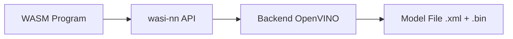
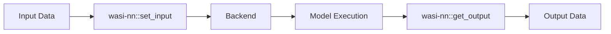
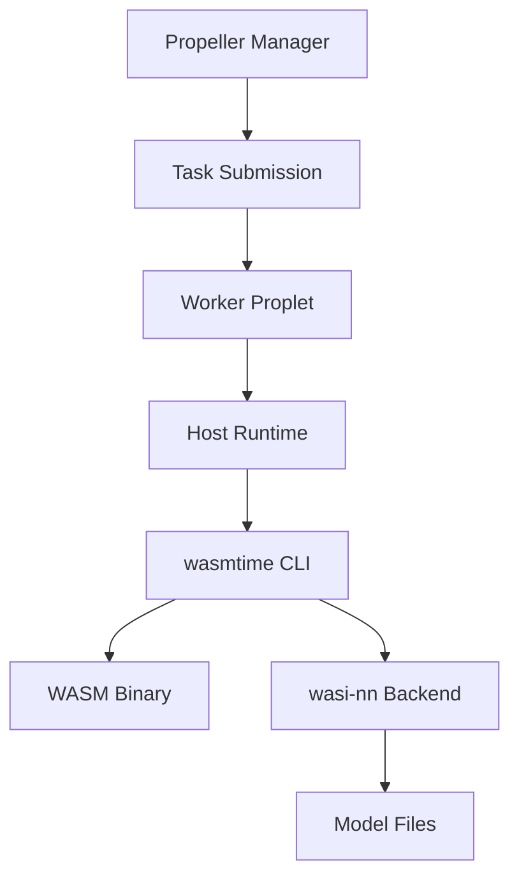

# Running wasi-nn Examples on Propeller

This guide explains how to run WebAssembly Neural Network (`wasi-nn`) examples from Wasmtime on Propeller's WASM execution platform.

## Table of Contents

1. [Conceptual Overview](#conceptual-overview)
2. [Propeller Integration](#propeller-integration)
3. [Prerequisites](#prerequisites)
4. [Step-by-Step Execution Flow](#step-by-step-execution-flow)
5. [Concrete Commands](#concrete-commands)
6. [Troubleshooting](#troubleshooting)

---

## Conceptual Overview

### How wasi-nn Works

**wasi-nn** is a WASI proposal that provides machine learning inference capabilities to WebAssembly programs. It follows a "graph loader" API design, allowing programs to:

1. **Load Models**: Load pre-trained ML models in a format-agnostic way
2. **Bind Inputs**: Provide input tensors to the model
3. **Execute Inference**: Run the model to perform inference
4. **Retrieve Outputs**: Extract output tensors from the model

**Key Components:**

- **Models**: Pre-trained ML models in backend-specific formats (e.g., OpenVINO IR, ONNX)
- **Backends**: Runtime implementations that execute the models (e.g., OpenVINO, ONNX Runtime)
- **Graph Execution**: The sequence of loading → binding inputs → executing → retrieving outputs
- **System Interface**: Exposed via WASI functions like `load`, `set_input`, `compute`, `get_output`

**Model Loading Flow:**



**Inference Flow:**



### Mapping to Propeller's WASM Execution Environment

Propeller executes WASM workloads through:

1. **Manager**: Schedules tasks and distributes them to workers
2. **Workers (Proplets)**: Execute WASM binaries using configured runtimes
3. **Runtimes**:
   - **Wazero** (Go): Default embedded runtime
   - **Wasmtime** (Rust): Available in `proplet-rs`
   - **Host Runtime**: External runtime (e.g., `wasmtime` CLI) - **Required for wasi-nn**

**Why Host Runtime?**

wasi-nn support requires Wasmtime's experimental wasi-nn module, which is only available when using Wasmtime directly (not through Wazero). The host runtime allows Propeller to execute WASM using an external `wasmtime` binary with the `--wasi-modules=experimental-wasi-nn` flag.

**Execution Model:**



### Constraints and Assumptions

**Supported Backends:**
- **OpenVINO**: Currently the primary tested backend (version 2022.1.0.643)
- Other backends (ONNX Runtime, TensorFlow) may work but are less tested

**Model Formats:**
- Models must be pre-compiled to the backend format (e.g., OpenVINO IR: `.xml` + `.bin` pair)
- Format conversion must happen offline; wasi-nn does not perform conversion at runtime

**File Access:**
- Model files must be accessible to the Propeller worker
- Models can be:
  - Pre-staged on worker filesystem
  - Mounted via volume mounts (if Propeller supports it)
  - Referenced via environment variables or absolute paths

**Runtime Requirements:**
- Wasmtime must be installed on the worker with wasi-nn support
- OpenVINO runtime libraries must be installed on the worker (if using OpenVINO backend)
- Worker must be configured to use the host runtime with `wasmtime` as the external runtime

---

## Propeller Integration

### Architecture Overview

When running wasi-nn workloads on Propeller:

1. **Task Creation**: WASM binary is uploaded to Propeller manager
2. **Task Scheduling**: Manager selects an appropriate worker
3. **Task Execution**: Worker receives task and:
   - Writes WASM binary to temporary file
   - Executes `wasmtime` CLI with wasi-nn flags
   - Passes environment variables for model paths
   - Captures stdout/stderr for results
4. **Result Retrieval**: Worker publishes results back to manager

### Host Runtime Configuration

The host runtime in Propeller (`proplet/runtimes/host.go`) executes WASM by:

1. Writing the WASM binary to a temporary file: `{task-id}.wasm`
2. Constructing a command: `wasmtime [CLIArgs] {task-id}.wasm [Args]`
3. Setting environment variables from `Env` map
4. Capturing stdout/stderr and publishing results

**For wasi-nn, configure:**
- `CLIArgs`: `["--wasi-modules=experimental-wasi-nn"]`
- `Env`: Model directory path (e.g., `MODEL_DIR=/models`)
- `FunctionName`: Not used by host runtime (wasmtime executes the WASM directly)

### Task Structure

A Propeller task for wasi-nn includes:

```json
{
  "name": "wasi-nn-inference",
  "file": "<wasm-binary-bytes>",
  "cli_args": ["--wasi-modules=experimental-wasi-nn"],
  "env": {
    "MODEL_DIR": "/models"
  },
  "daemon": false
}
```

---

## Prerequisites

### Development Machine

1. **Rust Toolchain** with `wasm32-wasi` target:
   ```bash
   # Install Rust if not already installed
   # curl --proto '=https' --tlsv1.2 -sSf https://sh.rustup.rs | sh
   
   # Add WASI target
   rustup target add wasm32-wasi
   
   # Verify installation
   rustc --version
   rustup target list | grep wasm32-wasi
   ```

2. **Wasmtime Repository** (for examples):
   ```bash
   # Clone the repository
   git clone https://github.com/bytecodealliance/wasmtime.git
   
   # Navigate to wasi-nn examples
   cd wasmtime/crates/wasi-nn/examples
   
   # Verify examples exist
   ls -la
   ```

3. **Wasmtime CLI** (for local testing):
   ```bash
   # Option 1: Install via cargo (requires Rust)
   cargo install wasmtime-cli
   
   # Option 2: Download pre-built binary
   # Linux: wget https://github.com/bytecodealliance/wasmtime/releases/latest/download/wasmtime-v*-x86_64-linux.tar.xz
   # macOS: wget https://github.com/bytecodealliance/wasmtime/releases/latest/download/wasmtime-v*-x86_64-macos.tar.xz
   # Extract and add to PATH
   
   # Verify installation
   wasmtime --version
   ```

### Propeller Worker Machine

1. **Wasmtime CLI** installed and in PATH:
   ```bash
   which wasmtime
   wasmtime --version
   ```

2. **OpenVINO Runtime** (if using OpenVINO backend):
   - Install OpenVINO 2022.1.0.643 or compatible version
   - Ensure libraries are in `LD_LIBRARY_PATH`

3. **Propeller Worker** configured with:
   - Host runtime enabled
   - `EXTERNAL_WASM_RUNTIME` environment variable set to `wasmtime`

4. **Model Files** staged on worker:
   - Models in OpenVINO IR format (`.xml` + `.bin`)
   - Accessible at a known path (e.g., `/models`)

---

## Step-by-Step Execution Flow

### Phase 1: Build wasi-nn WASM Binaries

**Location**: `wasmtime/crates/wasi-nn/examples/`

**Available Examples** (typical structure):
- `rust/`: Rust examples using wasi-nn bindings
- `c/`: C examples (if available)

**Build Process:**

```bash
# Navigate to examples directory
cd wasmtime/crates/wasi-nn/examples/rust

# Build for WASM target
cargo build --target wasm32-wasi --release

# Output location
ls -lh target/wasm32-wasi/release/*.wasm
```

**Example Output:**
- `classification.wasm`: Image classification example
- `inference.wasm`: Generic inference example

### Phase 2: Prepare Model Artifacts

**Model Requirements:**
- Format: OpenVINO IR (`.xml` + `.bin` pair)
- Location: Accessible to Propeller worker

**Workflow:**

```bash
# 1. Obtain or convert model to OpenVINO format
# Example: Use OpenVINO Model Optimizer (mo.py)
# mo.py --input_model model.onnx --output_dir /models

# 2. Verify model files
ls -lh /models/
# Should show: model.xml, model.bin

# 3. Copy to worker (if worker is remote)
scp /models/*.xml /models/*.bin worker:/models/
```

**Model Path Convention:**
- Models should be in a directory accessible to the worker
- Use environment variable `MODEL_DIR` to specify the path
- Example: `MODEL_DIR=/models` → worker looks for models in `/models/`

### Phase 3: Test Locally (Before Propeller)

**Verify wasi-nn Support:**

```bash
# Check wasmtime supports wasi-nn
# Note: wasmtime must be installed (cargo install wasmtime-cli or download from releases)
wasmtime --help 2>&1 | grep -i wasi-nn || echo "wasi-nn support may not be available in this wasmtime build"

# Run example locally
wasmtime --wasi-modules=experimental-wasi-nn \
  --env MODEL_DIR=/models \
  target/wasm32-wasi/release/classification.wasm
```

**Expected Output:**
- Inference results printed to stdout
- Any errors logged to stderr

### Phase 4: Configure Propeller Worker

**Worker Configuration** (`config.toml` or environment variables):

```toml
[proplet]
domain_id = "..."
client_id = "..."
client_key = "..."
channel_id = "..."
```

**Environment Variables:**
```bash
export EXTERNAL_WASM_RUNTIME=wasmtime
```

**Verify Worker Setup:**
```bash
# Check wasmtime is available
which wasmtime

# Check OpenVINO (if using)
# Linux: ldconfig -p | grep openvino
# macOS: otool -L /path/to/libopenvino.dylib
ldconfig -p 2>/dev/null | grep openvino || echo "OpenVINO libraries not found in system paths"
```

### Phase 5: Submit Task to Propeller

**Via Propeller CLI:**

```bash
# 1. Create task
propeller tasks create wasi-nn-inference

# 2. Get task ID (requires jq: sudo apt-get install jq or brew install jq)
TASK_ID=$(propeller tasks list | jq -r '.tasks[] | select(.name=="wasi-nn-inference") | .id')

# 3. Update task with WASM binary and configuration (via API)
# Cross-platform base64 encoding (works on both GNU and BSD base64)
WASM_B64=$(base64 -w 0 classification.wasm 2>/dev/null || base64 classification.wasm | tr -d '\n')

curl -X PUT http://manager:8080/tasks/$TASK_ID \
  -H "Content-Type: application/json" \
  -d "{
    \"name\": \"wasi-nn-inference\",
    \"file\": \"$WASM_B64\",
    \"cli_args\": [\"--wasi-modules=experimental-wasi-nn\"],
    \"env\": {\"MODEL_DIR\": \"/models\"},
    \"daemon\": false
  }"

# 4. Start task
propeller tasks start $TASK_ID
```

**Via Propeller API:**

```bash
# Step 1: Create task (with name only)
TASK_RESPONSE=$(curl -X POST http://manager:8080/tasks \
  -H "Content-Type: application/json" \
  -d '{
    "name": "wasi-nn-inference"
  }')

# Extract task ID (requires jq: sudo apt-get install jq or brew install jq)
TASK_ID=$(echo "$TASK_RESPONSE" | jq -r '.task.id')

# Step 2: Update task with WASM binary and configuration
# Note: File should be base64-encoded bytes
# For GNU base64 (Linux): use -w 0 to disable line wrapping
# For BSD base64 (macOS): omit -w flag
WASM_B64=$(base64 -w 0 classification.wasm 2>/dev/null || base64 classification.wasm | tr -d '\n')

curl -X PUT http://manager:8080/tasks/$TASK_ID \
  -H "Content-Type: application/json" \
  -d "{
    \"name\": \"wasi-nn-inference\",
    \"file\": \"$WASM_B64\",
    \"cli_args\": [\"--wasi-modules=experimental-wasi-nn\"],
    \"env\": {
      \"MODEL_DIR\": \"/models\"
    },
    \"daemon\": false
  }"

# Step 3: Start task
curl -X POST http://manager:8080/tasks/$TASK_ID/start
```

### Phase 6: Monitor Execution

**Check Task Status:**

```bash
# View task
propeller tasks view <task-id>

# Or via API
curl http://manager:8080/tasks/<task-id>
```

**View Logs:**

```bash
# Propeller worker logs (if accessible)
tail -f /var/log/propeller/proplet.log

# Or check manager logs for task status
tail -f /var/log/propeller/manager.log
```

**Retrieve Results:**

Results are published to MQTT topic: `m/{domain_id}/c/{channel_id}/control/proplet/results`

Or query via API:
```bash
curl http://manager:8080/tasks/<task-id>
# Response includes "results" field with stdout output
```

---

## Concrete Commands

### Complete Workflow Example

**Step 1: Build WASM Example**

```bash
# Clone Wasmtime
git clone https://github.com/bytecodealliance/wasmtime.git
cd wasmtime

# Navigate to wasi-nn examples
cd crates/wasi-nn/examples/rust

# Build WASM binary
cargo build --target wasm32-wasi --release

# Verify output (file command is usually pre-installed on Linux/macOS)
file target/wasm32-wasi/release/classification.wasm
# Expected output: WebAssembly (wasm) binary module version 0x1
# Note: If file command not found, install with: sudo apt-get install file or brew install file

# Note the path for later
WASM_PATH="$(pwd)/target/wasm32-wasi/release/classification.wasm"
```

**Step 2: Prepare Models**

```bash
# Create model directory
mkdir -p /tmp/wasi-nn-models

# Download or convert model to OpenVINO format
# Example: If you have a model in ONNX format
# mo.py --input_model model.onnx --output_dir /tmp/wasi-nn-models

# For testing, you can use a sample model from OpenVINO Model Zoo
# Example: Download AlexNet
# wget -O /tmp/wasi-nn-models/alexnet.xml <model-url>
# wget -O /tmp/wasi-nn-models/alexnet.bin <model-url>

# Verify model files
ls -lh /tmp/wasi-nn-models/
# Should show: *.xml and *.bin files
```

**Step 3: Test Locally**

```bash
# Install OpenVINO (if not installed)
# Follow: https://docs.openvino.ai/latest/openvino_docs_install_guides_installing_openvino_linux.html

# Test WASM execution
wasmtime --wasi-modules=experimental-wasi-nn \
  --env MODEL_DIR=/tmp/wasi-nn-models \
  "$WASM_PATH"

# Expected: Inference output printed to stdout
```

**Step 4: Stage Models on Worker**

```bash
# Copy models to worker (adjust host/path as needed)
scp /tmp/wasi-nn-models/* worker-host:/models/

# Or if worker is local
sudo mkdir -p /models
sudo cp /tmp/wasi-nn-models/* /models/
sudo chmod -R 755 /models
```

**Step 5: Configure Propeller Worker**

```bash
# On worker machine, ensure wasmtime is in PATH
which wasmtime

# Set environment variable for host runtime
export EXTERNAL_WASM_RUNTIME=wasmtime

# Or add to worker's config.toml/systemd service
```

**Step 6: Submit Task via Propeller**

```bash
# Set manager URL
export PROPELLER_MANAGER_URL=http://localhost:8080

# Method 1: Using Propeller CLI
# Create task
propeller tasks create wasi-nn-inference

# Get task ID (from output or list)
# Note: Requires jq to be installed (sudo apt-get install jq or brew install jq)
TASK_ID=$(propeller tasks list | jq -r '.tasks[] | select(.name=="wasi-nn-inference") | .id')

# Update task with WASM binary (via API, as CLI may not support file upload)
# Cross-platform base64 encoding
WASM_B64=$(base64 -w 0 "$WASM_PATH" 2>/dev/null || base64 "$WASM_PATH" | tr -d '\n')

curl -X PUT "$PROPELLER_MANAGER_URL/tasks/$TASK_ID" \
  -H "Content-Type: application/json" \
  -d "{
    \"name\": \"wasi-nn-inference\",
    \"file\": \"$WASM_B64\",
    \"cli_args\": [\"--wasi-modules=experimental-wasi-nn\"],
    \"env\": {
      \"MODEL_DIR\": \"/models\"
    },
    \"daemon\": false
  }"

# Start task
propeller tasks start "$TASK_ID"

# Method 2: Direct API calls (alternative)
# Create task
TASK_RESPONSE=$(curl -X POST "$PROPELLER_MANAGER_URL/tasks" \
  -H "Content-Type: application/json" \
  -d '{"name": "wasi-nn-inference"}')

# Extract task ID (requires jq)
TASK_ID=$(echo "$TASK_RESPONSE" | jq -r '.task.id')

# Update with WASM and config
curl -X PUT "$PROPELLER_MANAGER_URL/tasks/$TASK_ID" \
  -H "Content-Type: application/json" \
  -d "{
    \"name\": \"wasi-nn-inference\",
    \"file\": \"$WASM_B64\",
    \"cli_args\": [\"--wasi-modules=experimental-wasi-nn\"],
    \"env\": {\"MODEL_DIR\": \"/models\"},
    \"daemon\": false
  }"

# Start task
curl -X POST "$PROPELLER_MANAGER_URL/tasks/$TASK_ID/start"
```

**Step 7: Monitor Execution**

```bash
# Check task status
propeller tasks view "$TASK_ID"

# Watch task status (requires watch command: sudo apt-get install watch or brew install watch)
watch -n 1 "propeller tasks view $TASK_ID | jq '.state'"

# Check worker logs (if accessible)
tail -f /var/log/propeller/proplet.log | grep "$TASK_ID"
```

**Step 8: Retrieve Results**

```bash
# Get task results
propeller tasks view "$TASK_ID" | jq '.results'

# Or via API
curl "$PROPELLER_MANAGER_URL/tasks/$TASK_ID" | jq '.results'
```

### Alternative: Using Propeller SDK (Go)

**Note**: The Propeller SDK's `Task` struct may not include all fields. Use the HTTP API directly or extend the SDK for full functionality.

**Option 1: Direct HTTP API calls from Go**

```go
package main

import (
    "bytes"
    "encoding/base64"
    "encoding/json"
    "io"
    "net/http"
    "os"
)

func main() {
    managerURL := "http://localhost:8080"
    
    // Step 1: Create task
    createReq := map[string]interface{}{
        "name": "wasi-nn-inference",
    }
    createBody, _ := json.Marshal(createReq)
    resp, _ := http.Post(managerURL+"/tasks", "application/json", bytes.NewReader(createBody))
    var createResp struct {
        Task struct {
            ID string `json:"id"`
        } `json:"task"`
    }
    json.NewDecoder(resp.Body).Decode(&createResp)
    taskID := createResp.Task.ID
    
    // Step 2: Read and encode WASM
    wasmBytes, _ := os.ReadFile("classification.wasm")
    wasmB64 := base64.StdEncoding.EncodeToString(wasmBytes)
    
    // Step 3: Update task
    updateReq := map[string]interface{}{
        "name": "wasi-nn-inference",
        "file": wasmB64,
        "cli_args": []string{"--wasi-modules=experimental-wasi-nn"},
        "env": map[string]string{
            "MODEL_DIR": "/models",
        },
        "daemon": false,
    }
    updateBody, _ := json.Marshal(updateReq)
    req, _ := http.NewRequest("PUT", managerURL+"/tasks/"+taskID, bytes.NewReader(updateBody))
    req.Header.Set("Content-Type", "application/json")
    http.DefaultClient.Do(req)
    
    // Step 4: Start task
    http.Post(managerURL+"/tasks/"+taskID+"/start", "application/json", nil)
}
```

**Option 2: Extend SDK (if SDK supports UpdateTask with all fields)**

```go
// Check if SDK.UpdateTask supports File, CLIArgs, Env fields
// If not, use Option 1 (direct HTTP API)
```

---

## Troubleshooting

### Common Issues

**1. wasi-nn module not found**

**Error:**

```text
Error: unknown flag: --wasi-modules
```

**Solution:**
- Ensure Wasmtime version supports wasi-nn (typically Wasmtime 0.40+)
- Check wasmtime build includes wasi-nn: `wasmtime --help | grep wasi-nn`

**2. Model files not found**

**Error:**

```text
Error: failed to load model: file not found
```

**Solution:**
- Verify model files exist on worker at the path specified in `MODEL_DIR`
- Check file permissions: `ls -la /models/`
- Ensure worker can access the model directory

**3. OpenVINO backend not available**

**Error:**

```text
Error: backend not available
```

**Solution:**
- Install OpenVINO runtime on worker
- Set `LD_LIBRARY_PATH` to include OpenVINO libraries
- Verify OpenVINO installation: `ldconfig -p | grep openvino`

**4. Host runtime not configured**

**Error:**

```text
Error: wasmtime command not found
```

**Solution:**
- Ensure `wasmtime` is in worker's PATH
- Set `EXTERNAL_WASM_RUNTIME=wasmtime` environment variable
- Verify worker is using host runtime (not wazero)

**5. Task fails silently**

**Debug Steps:**
- Check worker logs: `/var/log/propeller/proplet.log`
- Verify WASM binary is valid: `wasm-objdump -h classification.wasm`
- Test WASM locally first: `wasmtime --wasi-modules=experimental-wasi-nn classification.wasm`
- Check MQTT connectivity between manager and worker

### Debugging Commands

```bash
# Verify WASM binary (requires wasm-objdump from wabt package)
# Install with: sudo apt-get install wabt or brew install wabt
wasm-objdump -h classification.wasm 2>/dev/null || echo "wasm-objdump not found. Install wabt package."

# Test wasmtime locally
wasmtime --wasi-modules=experimental-wasi-nn \
  --env MODEL_DIR=/models \
  classification.wasm

# Check OpenVINO installation
ldconfig -p | grep openvino

# Verify worker configuration
cat /etc/propeller/config.toml | grep -A 5 proplet

# Check worker process
ps aux | grep proplet

# Monitor MQTT messages (requires mosquitto-clients)
# Install with: sudo apt-get install mosquitto-clients or brew install mosquitto
mosquitto_sub -h localhost -t 'm/+/c/+/control/proplet/#' -v 2>/dev/null || echo "mosquitto_sub not found. Install mosquitto-clients package."
```
