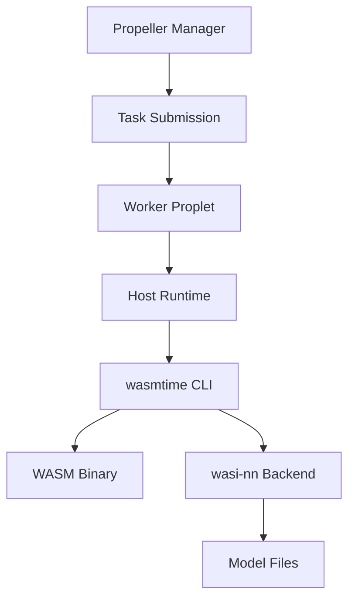

# Running wasi-nn on Propeller

This guide explains how to run WebAssembly Neural Network (wasi-nn) examples on Propeller's WASM execution platform.

## Overview

**wasi-nn** is a WASI proposal providing ML inference capabilities to WebAssembly programs through a graph loader API:

1. **Load Models** - Load pre-trained ML models in a format-agnostic way
2. **Bind Inputs** - Provide input tensors to the model
3. **Execute Inference** - Run the model to perform inference
4. **Retrieve Outputs** - Extract output tensors from the model

### Key Components

- **Models**: Pre-trained ML models in backend-specific formats (e.g., OpenVINO IR, ONNX)
- **Backends**: Runtime implementations that execute the models (e.g., OpenVINO, ONNX Runtime)
- **Graph Execution**: The sequence of loading → binding inputs → executing → retrieving outputs
- **System Interface**: Exposed via WASI functions like `load`, `set_input`, `compute`, `get_output`

**Model Loading Flow:** A WASM program calls the wasi-nn API, which uses the OpenVINO backend to read model files.


**Inference Flow:** Input data is passed via `set_input`, the backend executes the model, and results are retrieved via `get_output`.


### Propeller Integration

Propeller executes WASM workloads through:

1. **Manager**: Schedules tasks and distributes them to workers
2. **Workers (Proplets)**: Execute WASM binaries using configured runtimes
3. **Runtimes**:
   - **Wazero** (Go): Default embedded runtime
   - **Wasmtime** (Rust): Available in `proplet-rs`
   - **Host Runtime**: External runtime (e.g., `wasmtime` CLI) - **Required for wasi-nn**

**Why Host Runtime?** wasi-nn support requires Wasmtime's experimental wasi-nn module, which is only available when using Wasmtime directly (not through Wazero). The host runtime allows Propeller to execute WASM using an external `wasmtime` binary with wasi-nn enabled.

**Execution Model:** The Manager submits a task to a Worker, which invokes wasmtime CLI through the Host Runtime. Wasmtime executes the WASM binary with the wasi-nn backend accessing model files.



### Requirements

- **Backend**: OpenVINO (primary tested backend, v2022.1.0.643+). Other backends (ONNX Runtime, TensorFlow) may work but are less tested.
- **Models**: Pre-compiled to backend format (OpenVINO IR: `.xml` + `.bin`). Format conversion must happen offline.
- **Runtime**: Wasmtime with wasi-nn support + OpenVINO libraries installed on worker
- **File Access**: Model files must be accessible to the Propeller worker via filesystem or volume mounts

## Prerequisites

### Development Machine

1. **Rust Toolchain** with `wasm32-wasip1` target:

```bash
# Install Rust if not already installed
curl --proto '=https' --tlsv1.2 -sSf https://sh.rustup.rs | sh

# Add WASI target (note: wasm32-wasi was renamed to wasm32-wasip1)
rustup target add wasm32-wasip1

# Verify installation
rustc --version
rustup target list | grep wasm32-wasip1
```

2. **Wasmtime Repository** (for examples):

```bash
# Clone the repository
git clone https://github.com/bytecodealliance/wasmtime.git

# Navigate to wasi-nn examples
cd wasmtime/crates/wasi-nn/examples

# Available examples:
# - classification-example/: Image classification using MobileNet
# - classification-component-onnx/: ONNX-based classification
# - classification-example-pytorch/: PyTorch models
```

3. **Wasmtime CLI** with wasi-nn support:

```bash
# Option 1: Build from source with wasi-nn support
cd wasmtime
cargo build --release --features wasi-nn
# Binary will be at: target/release/wasmtime

# Option 2: Use pre-installed wasmtime (check for wasi-nn support)
wasmtime run -S help | grep nn
# Should show: -S nn[=y|n] -- Enable support for WASI neural network imports
```

### Worker Machine

1. **Wasmtime CLI** installed and in PATH:

```bash
which wasmtime
wasmtime --version

# Verify wasi-nn support
wasmtime run -S help | grep nn
```

2. **OpenVINO Runtime**:

**macOS:**
```bash
brew install openvino

# Libraries will be at /opt/homebrew/lib (Apple Silicon) or /usr/local/lib (Intel)
export DYLD_LIBRARY_PATH=/opt/homebrew/lib

# Verify installation
ls /opt/homebrew/lib | grep openvino
```

**Linux:**
```bash
# Install OpenVINO (follow official docs)
# https://docs.openvino.ai/latest/openvino_docs_install_guides_installing_openvino_linux.html

# Set library path
export LD_LIBRARY_PATH=/opt/intel/openvino/runtime/lib:$LD_LIBRARY_PATH

# Verify installation
ldconfig -p | grep openvino
```

3. **Propeller Worker** configured with:
   - Host runtime enabled
   - `EXTERNAL_WASM_RUNTIME` environment variable set to `wasmtime`
   - Proper MQTT credentials provisioned in SuperMQ

## Execution Steps

### 1. Build WASM Binary

```bash
cd wasmtime/crates/wasi-nn/examples/classification-example

# Build for WASM target
cargo build --target wasm32-wasip1 --release

# Verify output
ls -lh target/wasm32-wasip1/release/*.wasm
# Should show: wasi-nn-example.wasm
```

### 2. Prepare Model Files

```bash
# Create fixture directory
mkdir -p fixture && cd fixture

# Download MobileNet model files
curl -LO https://github.com/intel/openvino-rs/raw/main/crates/openvino/tests/mobilenet/mobilenet.xml
curl -LO https://github.com/intel/openvino-rs/raw/main/crates/openvino/tests/mobilenet/mobilenet.bin

# Rename for the example (expects model.xml and model.bin)
mv mobilenet.xml model.xml
mv mobilenet.bin model.bin

# Download input tensor (test image data)
curl -LO https://download.01.org/openvinotoolkit/fixtures/mobilenet/tensor-1x224x224x3-f32.bgr

# Verify all files
ls -lh
# Should show: model.xml, model.bin, tensor-1x224x224x3-f32.bgr

cd ..
```

**Note:** The example code looks for models in the `fixture/` directory. This directory must be mapped to the WASM module via `--dir=fixture` flag.

### 3. Test Locally

Before submitting to Propeller, verify the setup works locally:

```bash
# Verify wasi-nn support
wasmtime --version
wasmtime run -S help | grep nn

# Set library path (macOS Apple Silicon)
export DYLD_LIBRARY_PATH=/opt/homebrew/lib

# Execute with wasi-nn enabled (Wasmtime 14.0+)
wasmtime run -S nn --dir=fixture target/wasm32-wasip1/release/wasi-nn-example.wasm

# For older Wasmtime versions (0.40-13.x):
# wasmtime --wasi-modules=experimental-wasi-nn --dir=fixture target/wasm32-wasip1/release/wasi-nn-example.wasm
```

**Expected Output:**

```
Read graph XML, first 50 characters: <?xml version="1.0" ?>
<net name="mobilenet_v2_1.0
Read graph weights, size in bytes: 13956476
Loaded graph into wasi-nn with ID: 0
Created wasi-nn execution context with ID: 0
Read input tensor, size in bytes: 602112
Executed graph inference
Found results, sorted top 5: [InferenceResult(904, 0.4025879), InferenceResult(885, 0.3581543), ...]
```

### 4. Configure Propeller

#### Provision SuperMQ Credentials

```bash
cd /path/to/propeller

# Run provisioning (creates domain, channels, and clients in SuperMQ)
propeller-cli provision

# This generates a config.toml file with manager, proplet, and proxy credentials
```

#### Update Environment Variables

Update your `.env` file with values from the generated `config.toml`:

```bash
# Proplet Configuration
PROPLET_DOMAIN_ID="<from-config>"
PROPLET_CHANNEL_ID="<from-config>"
PROPLET_CLIENT_ID="<from-config>"
PROPLET_CLIENT_KEY="<from-config>"
PROPLET_EXTERNAL_WASM_RUNTIME="wasmtime"
```

> **Warning:** Do not mix environment variables AND config file methods. Choose one approach.

#### Configure Docker Compose

Update `compose.yaml` with volume mounts and library paths:

```yaml
proplet:
  image: ghcr.io/absmach/propeller/proplet:latest
  environment:
    PROPLET_LOG_LEVEL: ${PROPLET_LOG_LEVEL}
    PROPLET_MQTT_ADDRESS: ${PROPLET_MQTT_ADDRESS}
    PROPLET_DOMAIN_ID: ${PROPLET_DOMAIN_ID}
    PROPLET_CHANNEL_ID: ${PROPLET_CHANNEL_ID}
    PROPLET_CLIENT_ID: ${PROPLET_CLIENT_ID}
    PROPLET_CLIENT_KEY: ${PROPLET_CLIENT_KEY}
    PROPLET_EXTERNAL_WASM_RUNTIME: ${PROPLET_EXTERNAL_WASM_RUNTIME}
    # Platform-specific library path
    DYLD_LIBRARY_PATH: "/opt/homebrew/lib"  # macOS
    # LD_LIBRARY_PATH: "/usr/local/lib"     # Linux
  volumes:
    # Mount fixture directory (use absolute paths)
    - /Users/username/wasmtime/crates/wasi-nn/examples/classification-example/fixture:/fixture
```

#### Start Services

```bash
docker compose up -d

# Wait for services to initialize
sleep 10

# Verify proplet registered with manager
docker compose logs manager | grep "successfully created proplet"
```

### 5. Submit Task

#### Task Structure

A Propeller task for wasi-nn includes:

```json
{
  "name": "wasi-nn-inference",
  "file": "<base64-encoded-wasm-binary>",
  "cli_args": ["-S", "nn", "--dir=fixture"],
  "env": {
    "DYLD_LIBRARY_PATH": "/opt/homebrew/lib"
  },
  "daemon": false
}
```

> **Note:** The `cli_args` must be an array with separate elements. Do not combine multiple flags into a single string.

#### Submit via CLI and API

```bash
cd wasmtime/crates/wasi-nn/examples/classification-example

# Create task
propeller-cli tasks create wasi-nn-demo

# Save task ID from output
TASK_ID="<id-from-output>"

# Encode WASM binary to base64
# macOS:
WASM_B64=$(base64 -i target/wasm32-wasip1/release/wasi-nn-example.wasm | tr -d '\n')

# Linux:
# WASM_B64=$(base64 -w 0 target/wasm32-wasip1/release/wasi-nn-example.wasm)

# Update task with WASM binary and configuration
curl -X PUT http://localhost:7070/tasks/$TASK_ID \
  -H "Content-Type: application/json" \
  -d "{
    \"name\": \"wasi-nn-demo\",
    \"file\": \"$WASM_B64\",
    \"cli_args\": [\"-S\", \"nn\", \"--dir=fixture\"],
    \"env\": {\"DYLD_LIBRARY_PATH\": \"/opt/homebrew/lib\"},
    \"daemon\": false
  }"

# Start task
propeller-cli tasks start $TASK_ID
```

### 6. Monitor Execution

**Check Task Status:**

```bash
# View task details
propeller-cli tasks view $TASK_ID

# Task states: 0=Created, 1=Pending, 2=Running, 3=Completed, 4=Failed
```

**View Logs:**

```bash
# Proplet execution logs
docker compose logs proplet --tail 100

# Expected to see:
# {"level":"INFO","msg":"Executing task","task_id":"..."}
# {"level":"INFO","msg":"Task completed","task_id":"...","exit_code":0}

# Manager logs
docker compose logs manager --tail 50
```

**Retrieve Results:**

```bash
curl -s http://localhost:7070/tasks/$TASK_ID | jq '.results'
```

## Platform Notes

| Platform | Library Path Var | Base64 Flag | OpenVINO Path |
|----------|-----------------|-------------|---------------|
| macOS (Intel) | `DYLD_LIBRARY_PATH` | `-i` | `/usr/local/lib` |
| macOS (Apple Silicon) | `DYLD_LIBRARY_PATH` | `-i` | `/opt/homebrew/lib` |
| Linux | `LD_LIBRARY_PATH` | `-w 0` | `/opt/intel/openvino/runtime/lib` |

### macOS Notes

- Use `DYLD_LIBRARY_PATH` (not `LD_LIBRARY_PATH`)
- Base64 requires `-i` flag; the `-w` flag doesn't exist on macOS
- Docker platform warning about linux/amd64 vs linux/arm64 is normal (uses Rosetta 2)

### Linux Notes

- Use `LD_LIBRARY_PATH` for OpenVINO libraries
- Base64 uses `-w 0` flag for no line wrapping
- Ensure model files have proper permissions: `chmod -R 755 /models`

## Troubleshooting

### wasi-nn module not recognized

**Symptom:** `Error: unknown flag: -S` or `Error: unknown flag: --wasi-modules`

**Solution:**

```bash
# Check wasmtime version
wasmtime --version

# Check available WASI options
wasmtime run -S help | grep nn

# Wasmtime 14.0+: use -S nn
# Wasmtime 0.40-13.x: use --wasi-modules=experimental-wasi-nn

# If not present, rebuild Wasmtime with wasi-nn:
cd /path/to/wasmtime
cargo build --release --features wasi-nn
```

### Model files not found

**Symptom:** `Error: failed to load model: file not found`

**Solution:**

```bash
# Verify model files exist
ls -lh fixture/model.xml fixture/model.bin

# Verify volume mounts in compose.yaml
docker compose config | grep -A 5 volumes

# Check proplet can access files
docker compose exec proplet ls -la /fixture

# Ensure --dir flag is included in cli_args
```

### OpenVINO backend not available

**Symptom:** `Error: Failed while accessing backend`

**Solution:**

```bash
# macOS: Verify OpenVINO installation
ls /opt/homebrew/lib | grep openvino
export DYLD_LIBRARY_PATH=/opt/homebrew/lib

# Linux: Verify OpenVINO installation
ldconfig -p | grep openvino
export LD_LIBRARY_PATH=/opt/intel/openvino/runtime/lib:$LD_LIBRARY_PATH

# Test locally first
wasmtime run -S nn --dir=fixture wasi-nn-example.wasm
```

### MQTT "client_id not found"

**Symptom:** `{"level":"WARN","msg":"failed to proxy from MQTT broker to client with id with error: client_id not found"}`

**Cause:** Client IDs in configuration don't exist in SuperMQ database.

**Solution:**

```bash
# Re-provision to create fresh clients
propeller-cli provision

# Update .env file with new client IDs from config.toml
# Ensure EXACT match between .env and config.toml

# Restart services
docker compose down && docker compose up -d
```

### Task not executing

**Symptom:** Manager logs show "Starting task completed" but proplet shows no execution logs.

**Solution:**

```bash
# Verify manager knows about proplet
docker compose logs manager | grep proplet

# Verify proplet subscription
docker compose logs proplet | grep "Subscribed to topic"

# Restart both manager and proplet
docker compose restart manager proplet
sleep 15

# Try task submission again
```

### Base64 encoding errors

**Symptom:** `Error: invalid base64` or task file is corrupted.

**Solution:**

```bash
# macOS (correct)
WASM_B64=$(base64 -i file.wasm | tr -d '\n')

# Linux (correct)
WASM_B64=$(base64 -w 0 file.wasm)
```

### Volume mount failures

**Symptom:** `Error: not a directory` or files not accessible in container.

**Solution:**

```bash
# Use ABSOLUTE paths in compose.yaml
volumes:
  - /Users/username/fixture:/fixture  # Correct
  - ~/fixture:/fixture                 # May not work (tilde expansion)
  - ./fixture:/fixture                 # Depends on docker compose location

# Verify mounts
docker compose exec proplet ls -la /fixture
```

## Verification Checklist

Before submitting a task, verify:

- [ ] Wasmtime installed with wasi-nn support: `wasmtime run -S help | grep nn`
- [ ] OpenVINO libraries accessible
- [ ] WASM binary built: `ls target/wasm32-wasip1/release/*.wasm`
- [ ] Model files present: `ls fixture/model.xml fixture/model.bin`
- [ ] Local test passes: `wasmtime run -S nn --dir=fixture wasi-nn-example.wasm`
- [ ] Propeller services running: `docker compose ps`
- [ ] Proplet registered: `docker compose logs manager | grep "successfully created proplet"`
- [ ] Credentials match in `.env` and `config.toml`
- [ ] Volume mounts use absolute paths

## Resources

- [Wasmtime wasi-nn Documentation](https://github.com/bytecodealliance/wasmtime/tree/main/crates/wasi-nn)
- [OpenVINO Installation Guide](https://docs.openvino.ai/latest/openvino_docs_install_guides_installing_openvino.html)
- [Propeller Documentation](https://docs.propeller.absmach.eu/)
- [SuperMQ Documentation](https://docs.supermq.abstractmachines.fr/)
