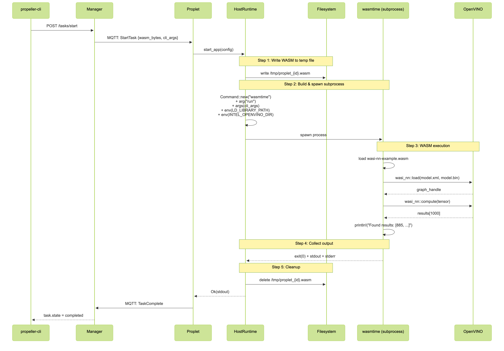

# Running wasi-nn on Propeller

[Propeller](https://github.com/absmach/propeller) is a WebAssembly orchestrator for the Cloud-Edge continuum. This guide shows how to run wasi-nn inference workloads on Propeller.

For general Propeller setup, see the [Getting Started guide](https://docs.propeller.absmach.eu/getting-started/).

## Architecture



**How it works:**

1. You submit a task to the Manager via REST API (port 7070)
2. Manager sends the task to a Proplet via MQTT
3. Proplet spawns wasmtime as external process with `-S nn` flag
4. wasmtime loads the WASM module and calls wasi-nn APIs
5. OpenVINO backend runs the actual ML inference
6. Results flow back: wasmtime → Proplet → Manager → API

## Table of Contents

- [Prerequisites](#prerequisites)
- [Setup](#setup)
- [Running wasi-nn Tasks](#running-wasi-nn-tasks)
- [Notes](#notes)

## Prerequisites

- Go 1.24+
- Docker and Docker Compose
- Make
- Wasmtime with wasi-nn support

## Setup

### 1. Clone and Build Propeller

```bash
git clone https://github.com/absmach/propeller.git
cd propeller
make all -j $(nproc)
make install
```

This installs `propeller-cli`, `propeller-manager`, `propeller-proplet`, and `propeller-proxy` to your `$GOBIN`.

### 2. Start SuperMQ

```bash
make start-supermq
```

This starts all services via Docker Compose. On first run, Propeller services will fail because `config.toml` doesn't exist yet.

### 3. Provision Credentials

```bash
propeller-cli provision
```

This creates a `config.toml` with MQTT credentials:

```toml
[manager]
domain_id = "182c0907-002c-4bfd-8bf3-e4f40c58dde6"
client_id = "f2fe9a33-144a-4346-a5d6-38e2eb07815e"
client_key = "ef7da52b-c01f-4b62-9502-6723d639405b"
channel_id = "8c6e1e6c-fc89-43b4-b00b-884a690c7419"

[proplet]
domain_id = "182c0907-002c-4bfd-8bf3-e4f40c58dde6"
client_id = "fa407362-9c5f-41b8-9a09-9d0c0b039287"
client_key = "991c4d03-2f2c-4ba5-97a6-45bead85457e"
channel_id = "8c6e1e6c-fc89-43b4-b00b-884a690c7419"

[proxy]
domain_id = "182c0907-002c-4bfd-8bf3-e4f40c58dde6"
client_id = "fa407362-9c5f-41b8-9a09-9d0c0b039287"
client_key = "991c4d03-2f2c-4ba5-97a6-45bead85457e"
channel_id = "8c6e1e6c-fc89-43b4-b00b-884a690c7419"
```

### 4. Configure for wasi-nn

For wasi-nn workloads, the proplet needs:

1. External runtime enabled (wasmtime spawned as subprocess)
2. OpenVINO libraries accessible
3. Model files mounted

Update `docker/.env`:

```bash
PROPLET_EXTERNAL_WASM_RUNTIME=wasmtime
```

Mount config and model files in `docker/compose.yaml` under the proplet service:

```yaml
proplet:
  volumes:
    - ./config.toml:/home/proplet/config.toml
    - ./fixture:/home/proplet/fixture
```

Copy config to docker folder:

```bash
cp config.toml docker/config.toml
```

### 5. Restart Services

```bash
make stop-supermq
make start-supermq
```

Verify proplet registered:

```bash
curl http://localhost:7070/proplets
```

Response:

```json
{
  "offset": 0,
  "limit": 100,
  "total": 1,
  "proplets": [
    {
      "id": "837c3637-613d-4b1b-b9b6-15eef41ecb2a",
      "name": "Deboard-Longnecker",
      "task_count": 4,
      "alive": true,
      "alive_history": [
        "2026-02-04T23:13:27.529808591Z",
        "2026-02-04T23:13:37.516113512Z",
        "2026-02-04T23:13:40.666641138Z",
        "2026-02-04T23:13:47.522552669Z",
        "2026-02-04T23:13:57.514893674Z",
        "2026-02-04T23:14:07.519792762Z",
        "2026-02-04T23:14:13.847070834Z",
        "2026-02-04T23:14:17.519196836Z",
        "2026-02-04T23:14:27.540802216Z",
        "2026-02-04T23:14:37.553306429Z"
      ]
    }
  ]
}
```

## Running wasi-nn Tasks

### Build the WASM Binary

From the wasmtime wasi-nn examples:

```bash
cd wasmtime/crates/wasi-nn/examples/classification-example
cargo build --target wasm32-wasip1 --release
```

### Prepare Model Files

Copy model files to the mounted fixture directory:

```bash
cp -r fixture/* /path/to/propeller/docker/fixture/
```

### Create Task

Create task with `cli_args` for wasi-nn:

```bash
curl -X POST "http://localhost:7070/tasks" \
  -H "Content-Type: application/json" \
  -d '{
    "name": "mobilenet-inference",
    "cli_args": ["-S", "nn", "--dir=/home/proplet/fixture::fixture"]
  }'
```

Response:

```json
{
  "id": "e9858e56-a1dd-4e5a-9288-130f7be783ed",
  "name": "mobilenet-inference",
  "state": 0,
  "cli_args": ["-S", "nn", "--dir=/home/proplet/fixture::fixture"],
  "created_at": "2026-01-27T14:25:22.407167091+03:00"
}
```

Save the task ID:

```bash
TASK_ID="e9858e56-a1dd-4e5a-9288-130f7be783ed"
```

### Upload WASM Binary

```bash
curl -X PUT "http://localhost:7070/tasks/${TASK_ID}/upload" \
  -F "file=@target/wasm32-wasip1/release/wasi-nn-example.wasm"
```

Or update with base64-encoded WASM:

```bash
curl -X PUT "http://localhost:7070/tasks/${TASK_ID}" \
  -H "Content-Type: application/json" \
  -d "{\"file\": \"$(base64 -w0 target/wasm32-wasip1/release/wasi-nn-example.wasm)\"}"
```

### Start Task

```bash
curl -X POST "http://localhost:7070/tasks/${TASK_ID}/start"
```

### Using the CLI

```bash
# Create task
propeller-cli tasks create mobilenet-inference

# Get task ID from output, then upload and start
curl -X PUT "http://localhost:7070/tasks/${TASK_ID}/upload" \
  -F "file=@target/wasm32-wasip1/release/wasi-nn-example.wasm"

propeller-cli tasks start ${TASK_ID}
```

### Check Results

```bash
curl "http://localhost:7070/tasks/${TASK_ID}"
```

View proplet logs:

```bash
docker compose -f docker/compose.yaml logs proplet --tail 100
```

### Stop Task

```bash
curl -X POST "http://localhost:7070/tasks/${TASK_ID}/stop"
```

## Notes

### cli_args Explained

| Flag                                   | Purpose                                  |
| -------------------------------------- | ---------------------------------------- |
| `-S nn`                                | Enables wasi-nn support in wasmtime      |
| `--dir=/home/proplet/fixture::fixture` | Maps container path to WASM sandbox path |

The `--dir` syntax is `host_path::guest_path`. The WASM module sees files at `fixture/` while the actual files are at `/home/proplet/fixture` in the container.

### External Runtime

wasi-nn requires external runtime mode because:

- wasmtime needs the `-S nn` flag to enable wasi-nn imports
- OpenVINO requires `LD_LIBRARY_PATH` to find libraries
- Subprocess model provides better fault isolation

Set `PROPLET_EXTERNAL_WASM_RUNTIME=wasmtime` in your environment.

### Volume Mounts

Model files need two mappings:

| Layer            | Mapping                           | Purpose                    |
| ---------------- | --------------------------------- | -------------------------- |
| Host → Container | `./fixture:/home/proplet/fixture` | Docker volume mount        |
| Container → WASM | `--dir=...::fixture` in cli_args  | wasmtime directory mapping |

### Troubleshooting

**Task fails with "unknown import: wasi_nn"**

The `-S nn` flag is missing from cli_args. Create a new task with correct cli_args (cli_args cannot be modified after creation).

**Model files not found**

Check both volume mount (Docker) and `--dir` flag (cli_args). Verify files exist:

```bash
docker compose -f docker/compose.yaml exec proplet ls -la /home/proplet/fixture
```

**"Failed to spawn host runtime process"**

`PROPLET_EXTERNAL_WASM_RUNTIME` is not set. Add it to your `.env` and restart:

```bash
PROPLET_EXTERNAL_WASM_RUNTIME=wasmtime
make stop-supermq && make start-supermq
```

**OpenVINO backend not available**

The proplet container needs OpenVINO libraries. The official proplet image includes OpenVINO. If running locally, ensure `LD_LIBRARY_PATH` includes the OpenVINO lib directory.

## References

- [Propeller Documentation](https://docs.propeller.absmach.eu/)
- [Propeller Getting Started](https://docs.propeller.absmach.eu/getting-started/)
- [wasi-nn Specification](https://github.com/WebAssembly/wasi-nn)
- [Wasmtime wasi-nn](https://github.com/bytecodealliance/wasmtime/tree/main/crates/wasi-nn)
